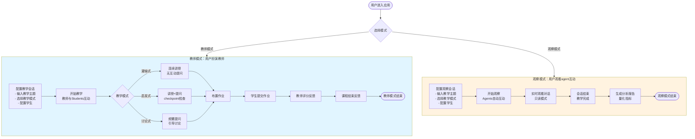
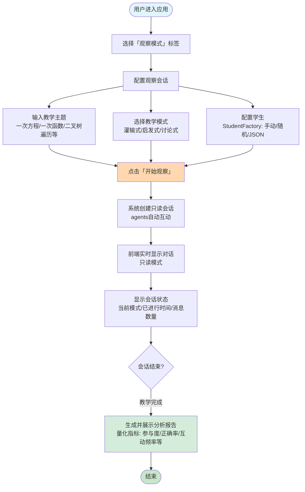
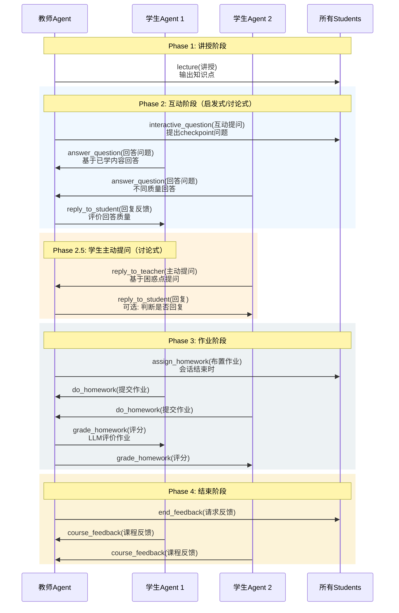
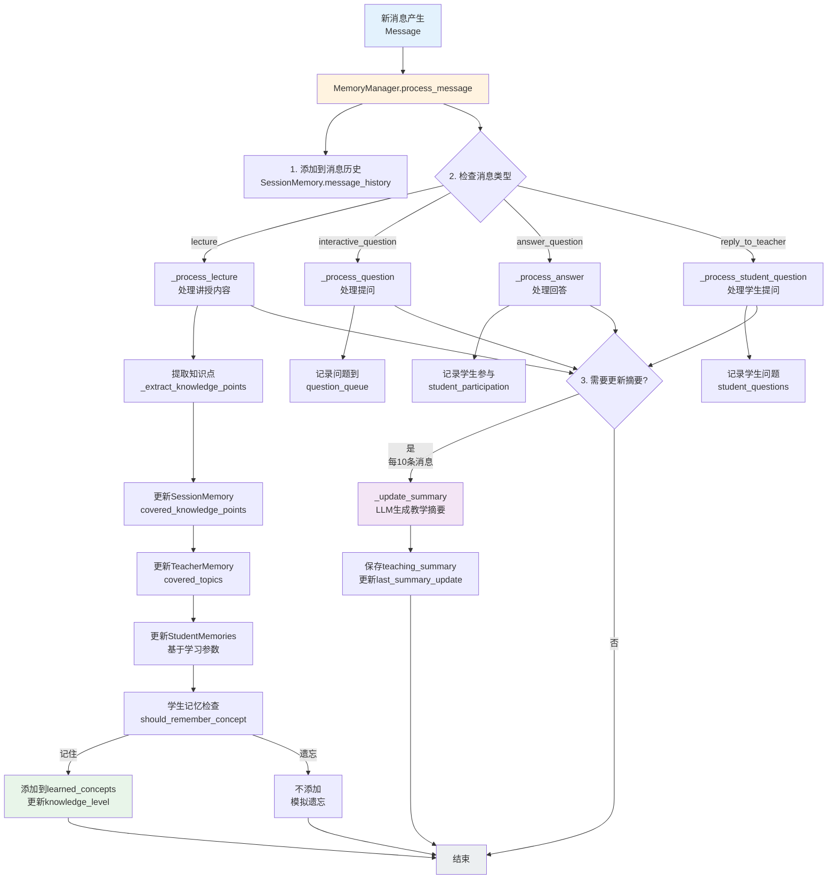
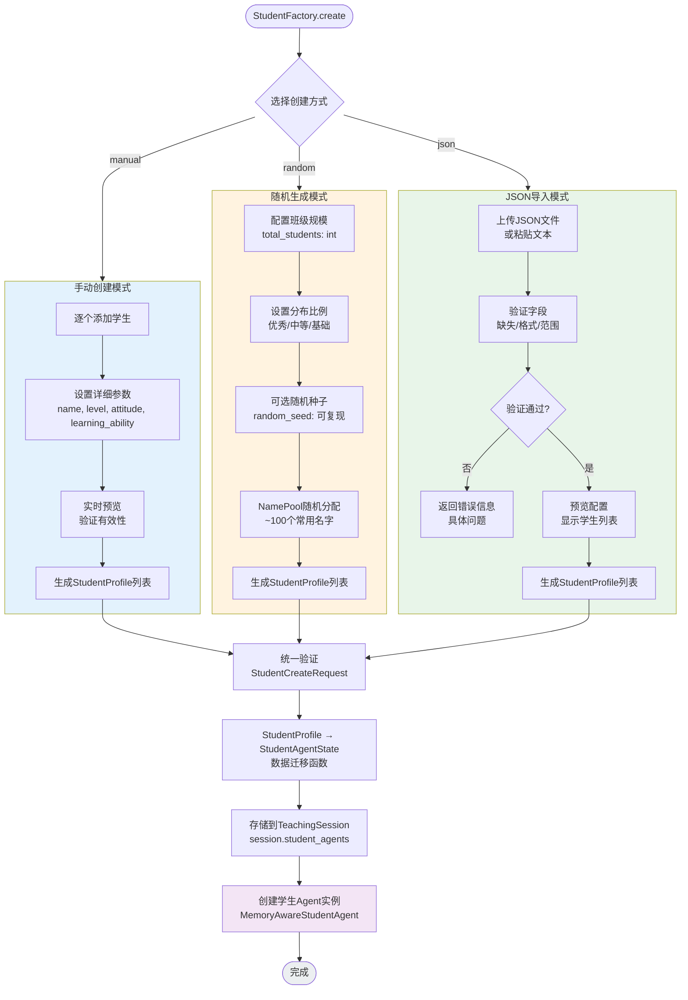
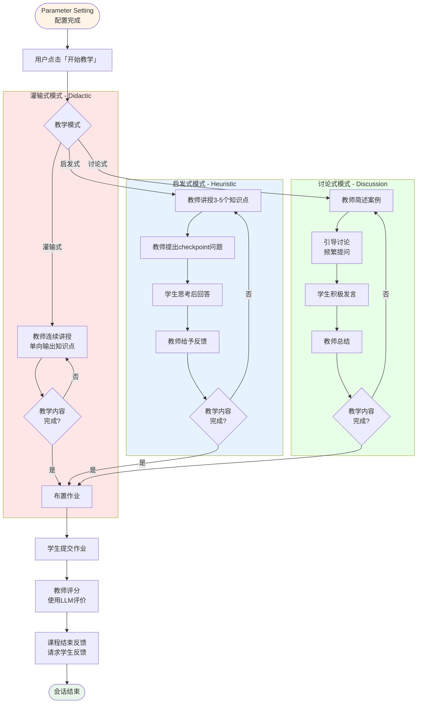
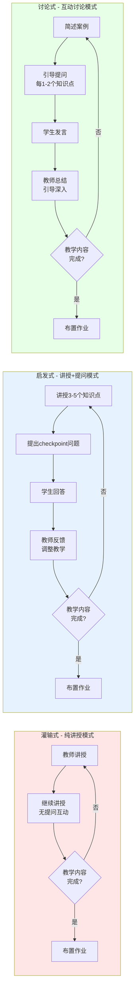

# Design: 教学智能体 - 多Agent教学模拟系统

Generated by /office-hours on 2026-04-03
Branch: main
Repo: teaching-ai-agent
Status: APPROVED
Mode: Builder

## Problem Statement

用户想要构建一个教学智能体系统，包含三种核心模式：
- **观察模式(Phase 1)**: 用户作为隐形观察者，观看教师agent和学生agent的自动互动，获得量化分析报告（教育研究场景）
- **教师模式(Phase 1.5)**: 用户扮演教师，控制多个学生AI智能体进行教学活动
- **学生模式(Phase 2, 未来)**: 用户扮演学生，与教师AI智能体进行一对一课堂互动

**Phase 1 聚焦**: 本设计文档专注于教师模式和观察模式的实现。

系统需要支持三种教学模式：
- **灌输式**: 以知识点讲解为主，不设置互动环节
- **启发式**: 结合案例教学，设置少量互动环节
- **讨论式**: 结合案例教学与互动提问，设置较多互动环节

## Constraints

- 技术栈已选定：FastAPI + LangChain + React
- 学习/黑客松项目，非创业方向
- **观察模式是最高优先级的交付成果**（教育研究核心）
- **数据库持久化必须实现**（实验数据用于研究报告）
- 使用硅基流动免费模型（Qwen2.5-7B-Instruct）

## Premises

1. **观察模式是核心交付成果**：满足教育研究人员的场景需求
2. **三种教学模式是工程交付成果**：灌输式/启发式/讨论式必须全部实现
3. **StudentFactory保持完整功能**：手动/随机/JSON三种创建方式全部保留（便于开发测试）
4. 数据持久化用于实验数据收集和研究报告生成
5. 多智能体协作应该对用户可见，不是黑盒魔法
6. 已有技术栈（FastAPI + LangChain + React）不变

## Cross-Model Perspective

独立AI视角（Codex）的建议：

**最酷的版本**: 一个教师智能体，三种教学模式可切换。不同教学模式下，教师的行为模式、提问频率、互动深度明显不同，学生agent的响应也随之变化。前端能清晰看到"当前教学模式"和课堂状态。

**现有工具**: OpenMAIC、LAILA等已存在，但缺少你的核心差异化：三种教学模式作为一等公民系统行为。

## Approaches Considered

### Approach A: Minimal — 单模式深度演示
只构建一种教学模式（如启发式），单一主题（如"二叉树遍历"），1个教师agent + 4-5个学生agent，仅文本交互，单次会话。

- 优点：最快交付，证明核心概念
- 缺点：不能验证3模式切换的核心需求

### Approach B: Balanced — 三模式完整实现（已选择）
一个教师智能体，支持3种教学模式切换，4-5名学生agent，单一主题，完整消息流（讲座/问答/作业/反馈），可见agent状态。

- 优点：完全匹配原始需求，清晰展示教学模式差异化，架构更简单
- 缺点：耗时较长（1-2周）

### Approach C: Pedagogy Simulator — 教学回放与分析
聚焦课后分析。教师授课 → 学生反应 → 系统生成"教学回放"，展示在哪里失去课堂控制、哪个学生掉队、哪种教学模式最有效。

- 优点：最独特，"教学回放"是其他人没做的
- 缺点：分析逻辑复杂

### Observation Mode Extension — 观察模式（最高优先级）

用户作为隐形观察者，观看教师agent和学生agent的自动互动，获得量化分析报告。这是为了满足教育研究人员的场景：研究不同教学模式对教学效果的影响。**观察模式是本项目的最高优先级交付成果**。

**核心特性**：
- 配置教学主题/教学模式/学生 → 自动运行教学会话
- 实时观看agent对话（只读模式，无法干预）
- 会话结束后生成量化分析报告：参与度、正确率、互动频率、知识掌握度等
- 数据库持久化：完整保存会话数据用于实验研究

**与核心模式的区别**：
- 教师模式：用户控制教学过程，agent响应用户输入（辅助功能，用于开发测试）
- 观察模式：用户只读观看，agent全自动互动（核心功能，教育研究工具）

## Recommended Approach

**Approach B: Balanced — 三模式完整实现 + 观察模式扩展**

原因：
1. 完全匹配你的原始需求
2. 能够展示完整的教学模式差异化
3. 证明multi-agent协同的价值
4. 为未来扩展（用户角色扮演）打下基础
5. **新增**：满足教育研究场景，提供量化分析能力

## System Flow Overview



## Observation Mode Architecture

### User Flow



### Observation Metrics Schema

```python
class ObservationMetrics:
    """观察模式分析指标"""
    session_id: str
    teaching_mode: TeachingMode
    course_id: str
    topic: str

    # 时间指标
    duration_seconds: Optional[int]  # 会话持续时长（秒），会话结束后计算
    message_count: int
    teacher_message_count: int
    student_message_count: int

    # 互动指标
    interaction_frequency: float  # 每分钟互动次数
    student_participation_rate: float  # 学生参与率

    # 学习效果指标
    average_knowledge_gain: float  # 平均知识掌握度提升
    average_correct_rate: float    # 平均回答正确率

    # 学生个体维度统计
    student_metrics: Dict[str, StudentMetrics]

class StudentMetrics:
    """学生个体维度统计"""
    student_id: str
    name: str
    level: StudentLevel
    attitude: StudentAttitude
    knowledge_gain: float
    participation: float
    correct_rate: float
    message_count: int
```

### UI Components

**1. 观察模式配置界面** (`ObservationConfig.tsx`)
- 复用：`CourseSelector`、`TeachingModeSelector`
- 复用：StudentFactory 的学生配置组件（手动创建/随机生成/JSON导入）
- 新增：「开始观察」按钮

**2. 观察界面** (`ObservationView.tsx`)
- 顶部状态栏：当前教学模式徽章、已进行时间
- 主内容区：消息列表（只读，复用 `MessageList`）
- 侧边栏（可选）：学生状态概览、实时指标

**3. 分析报告界面** (`AnalysisReport.tsx`)
- 课程和配置摘要
- 量化指标卡片：总消息数、互动频率、学生参与率、平均知识掌握度、平均正确率
- 学生个体统计：按学生分组的指标对比
- 教学模式对比（如有历史数据）

### Backend API Extensions

**WebSocket 实时通信**：

```python
# backend/routers/websocket.py

from fastapi import WebSocket
import json

@router.websocket("/ws/{session_id}")
async def websocket_endpoint(websocket: WebSocket, session_id: str):
    """WebSocket 端点 - 实时消息推送"""
    await websocket.accept()

    # 加载会话
    session = await load_session(session_id)
    if not session:
        await websocket.close(code=1008, reason="Session not found")
        return

    # 发送初始状态
    await websocket.send_json({
        "type": "session_state",
        "data": {
            "session_id": session.session_id,
            "teaching_mode": session.teaching_mode,
            "phase": session.phase,
            "student_agents": session.student_agents
        }
    })

    # 观察模式：自动运行会话
    if session.is_observation_mode:
        orchestrator = SessionOrchestrator(teacher_agent, student_agents)
        # 发送消息到前端
        async for message in orchestrator.run_autonomous_session_stream(session):
            await websocket.send_json({
                "type": "message",
                "data": message.dict()
            })

    # 教师模式：接收用户输入，广播给学生agents
    else:
        while True:
            data = await websocket.receive_json()

            if data["type"] == "user_input":
                # 用户输入（教师模式）
                response = await teacher_agent.process_user_input(data["content"])
                await websocket.send_json({
                    "type": "message",
                    "data": response.dict()
                })

            elif data["type"] == "ping":
                await websocket.send_json({"type": "pong"})
```

**HTTP API（补充）**：

```python
# backend/routers/observation.py

@router.post("/observation/start")
async def start_observation_session(config: ObservationConfig) -> SessionID

@router.get("/observation/{session_id}/report")
async def get_analysis_report(session_id: str) -> ObservationMetrics

# 注意：/observation/{session_id}/stream 已替换为 WebSocket
```

**前端 WebSocket 连接**：

```typescript
// frontend/src/hooks/useWebSocket.ts

export function useWebSocket(sessionId: string) {
  const [messages, setMessages] = useState<Message[]>([]);
  const [connectionState, setConnectionState] = useState<'connecting' | 'connected' | 'disconnected'>('connecting');

  useEffect(() => {
    const ws = new WebSocket(`ws://localhost:8000/ws/${sessionId}`);

    ws.onopen = () => setConnectionState('connected');

    ws.onmessage = (event) => {
      const data = JSON.parse(event.data);
      if (data.type === 'message') {
        setMessages(prev => [...prev, data.data]);
      } else if (data.type === 'session_state') {
        // 处理会话状态更新
      }
    };

    ws.onclose = () => setConnectionState('disconnected');

    return () => ws.close();
  }, [sessionId]);

  return { messages, connectionState };
}
```

### Analysis Service

### Analysis Service

```python
# backend/services/analyzer.py

class ObservationAnalyzer:
    """观察模式数据分析器"""

    def analyze_session(self, session: TeachingSession) -> ObservationMetrics:
        """分析会话数据，生成量化指标"""
        pass

    def compare_sessions(self, sessions: List[TeachingSession]) -> ComparisonReport:
        """对比多个会话"""
        pass
```

## Agent Interaction Flow

### Teacher-Student Message Sequence

教师和学生 agent 之间通过以下消息类型进行交互，展示一个完整的教学互动循环：



### Message Type Flow Matrix

| 教师消息类型 | 学生响应消息类型 | 发生条件 |
|-------------|---------------|---------|
| `lecture` | 无（被动接收） | 所有模式 |
| `interactive_question` | `answer_question` | 启发式、讨论式 |
| `reply_to_student` | 无（被动接收反馈） | 所有模式 |
| `assign_homework` | `do_homework` | 所有模式（会话结束） |
| `grade_homework` | 无（被动接收评分） | 所有模式 |
| `end_feedback` | `course_feedback` | 所有模式（会话最后） |
| 无（学生主动） | `reply_to_teacher` | 讨论式（积极学生） |

## Agent Message Types

### Teacher Message Types (6种)

1. **讲授模式 (lecture)**: 教师单向输出知识点，无互动
   - 灌输式：连续讲授，不主动暂停
   - 启发式：讲授中穿插1-2个checkpoint问题
   - 讨论式：讲授后立即引导讨论

2. **互动提问 (interactive_question)**: 教师向学生提问
   - 启发式：每讲授3-5个知识点后提问一次
   - 讨论式：频繁提问，每1-2个知识点后一次

3. **回复学生 (reply_to_student)**: 针对学生回答/提问的反馈
   - 所有模式：支持，但频率不同
   - 对于学生的问题，可以判断是否拒绝回复

4. **布置作业 (assign_homework)**: 会话结束时发布作业
   - 所有模式：会话结束前触发

5. **作业评分 (grade_homework)**: 评价学生提交的作业
   - 使用LLM评价学生提交的作业

6. **课程结束反馈 (end_feedback)**: 请求学生对课程进行反馈
   - 所有模式：会话最后一步

### Student Message Types (4种)

1. **回答互动提问 (answer_question)**: 响应教师的提问
   - 参数影响：`level`决定回答质量，`confidence`影响是否主动

2. **回复教师 (reply_to_teacher)**: 学生主动提问
   - 参数影响：`attitude`决定提问频率，`learning_ability`决定问题深度

3. **做作业 (do_homework)**: 提交作业结果
   - 参数影响：`level` + `learning_ability`决定作业质量

4. **课堂反馈 (course_feedback)**: 对课程的总结性反馈
   - 所有模式：会话结束时必选

## Session State Schema

```python
class TeachingSession:
    session_id: str
    teaching_mode: TeachingMode  #灌输式/启发式/讨论式
    topic: str                   #教学主题
    duration: Optional[int]      #参考时长(分钟)，仅作计划参考，实际结束由教学内容完成决定
    phase: SessionPhase          #parameter_setting/teaching/ended

    # 观察模式相关（新增）
    is_observation_mode: bool = False  # 是否为观察模式
    observer_read_only: bool = True   # 观察者只读标记

    teacher_agent: TeacherAgentState
    student_agents: List[StudentAgentState]

    current_step: int            #当前进行到第几步
    message_history: List[Message]
    start_time: datetime
    end_time: Optional[datetime]

class TeacherAgentState:
    agent_id: str
    name: str
    teaching_mode: TeachingMode

    # 当前教学状态
    question_queue: List[str]          # 待提问的问题队列
    
class StudentAgentState:
    agent_id: str
    name: str

    # 可配置参数
    level: StudentLevel          #基础/中等/优秀
    attitude: StudentAttitude    #积极/中性/消极
    learning_ability: int        #1-10

    # 个性化（支持手动创建和导入）
    gender: Optional[str]        # 性别
    background: Optional[str]    # 背景故事

    # 运行时状态
    knowledge_level: float       #0-1, 动态更新
    attention: float             #0-1, 注意力
    confidence: float            #0-1, 自信度
    misconception_count: int     #错误理解次数

    current_message: Optional[Message]
    last_interaction: Optional[datetime]

# 灵活学生配置系统（StudentFactory）
class StudentProfile:
    """学生配置文件 - 支持手动创建、随机生成、JSON导入"""
    student_id: str
    name: str = Field(min_length=1, max_length=20)  # 学生名字（必填，1-20字符）
    gender: Optional[str] = Field(max_length=10)  # 性别（可选）

    # 学习参数
    level: StudentLevel
    attitude: StudentAttitude
    learning_ability: int = Field(ge=1, le=10)  # 1-10，范围验证

    # 可选扩展字段
    background: Optional[str] = Field(max_length=500)  # 背景故事，限制长度

class StudentCreateRequest:
    """统一的学生创建请求"""
    source: str                  # manual/random/json
    
    # 手动创建模式
    manual_students: Optional[List[StudentProfile]]
    
    # 随机生成模式
    random_config: Optional[RandomClassConfig]
    
    # JSON 导入模式
    import_data: Optional[dict]

class RandomClassConfig:
    """随机班级生成配置"""
    total_students: int          # 总人数
    distribution: dict           # 学生分布比例
    random_seed: Optional[int]   # 随机种子（可复现）

class Message:
    id: str
    sender: str                  #agent_id or "user"
    receiver: str                #agent_id or "all"
    message_type: MessageType
    content: str
    timestamp: datetime
```

## Agent Memory & Context Management

### Problem

在教学场景中，agent 需要维护课堂内容的记忆以实现连贯的教学互动：

- **教师 agent**：需要记住已讲授的知识点、学生的问题和回答，以避免重复内容并确保教学连贯性
- **学生 agent**：需要模拟真实学生的学习记忆，能够引用之前学过的内容并逐渐掌握知识

LLM 本身是无状态的，每次调用都是独立的。如果没有良好的上下文管理：
- 教师会重复讲解相同内容
- 学生无法记住之前学过的知识点
- 教学过程会显得不自然、不连贯
- 无法模拟真实的学习曲线

### Architecture Overview

采用 **Summary Buffer Memory** 模式：在维护完整消息历史的同时，定期生成教学摘要并更新到 system prompt 中。

**核心思想**：
- 保留最近 N 条消息的完整历史（确保短期连贯性）
- 维护一个动态更新的教学摘要（确保长期记忆）
- 每次调用 agent 时，将完整历史和摘要组合成上下文

```
┌─────────────────────────────────────────────────────────┐
│                    Agent Memory System                   │
├─────────────────────────────────────────────────────────┤
│  Teaching Session Memory                                │
│  ├── message_history: List[Message] (完整历史)           │
│  ├── teaching_summary: str (动态教学摘要)                │
│  └── knowledge_points: List[str] (已讲授知识点)          │
│                                                         │
│  Teacher Agent Memory                                   │
│  ├── covered_topics: List[str] (已讲授主题)             │
│  ├── student_questions: List[str] (学生提出的问题)       │
│  └── teaching_progress: float (教学进度 0-1)            │
│                                                         │
│  Student Agent Memories (per student)                  │
│  ├── learned_concepts: List[str] (已学概念)             │
│  ├── confused_points: List[str] (困惑点)                │
│  └── knowledge_level: float (当前掌握度 0-1)             │
└─────────────────────────────────────────────────────────┘
```

### Memory Schema

```python
class SessionMemory:
    """会话级别的记忆管理"""
    session_id: str
    topic: str
    
    # 消息历史（完整保留，用于短期上下文）
    message_history: List[Message]
    max_history_messages: int = 50  # 保留最近50条消息
    
    # 教学摘要（动态更新，用于长期记忆）
    teaching_summary: str = ""
    covered_knowledge_points: List[str] = field(default_factory=list)
    
    # 摘要更新触发器
    summary_update_interval: int = 10  # 每10条消息更新一次摘要
    last_summary_update: int = 0
    
    def should_update_summary(self) -> bool:
        """判断是否需要更新摘要"""
        return len(self.message_history) - self.last_summary_update >= self.summary_update_interval
    
    def get_agent_context(self) -> str:
        """获取 agent 完整上下文"""
        recent_messages = self.message_history[-self.max_history_messages:]
        context_parts = [
            f"教学主题: {self.topic}",
            f"教学摘要: {self.teaching_summary}",
            f"已讲授知识点: {', '.join(self.covered_knowledge_points)}",
            "最近的对话:",
            self._format_messages(recent_messages)
        ]
        return "\n".join(context_parts)

class TeacherAgentMemory:
    """教师 agent 的专用记忆"""
    agent_id: str
    
    # 教学状态追踪
    covered_topics: List[str] = field(default_factory=list)
    student_questions: Dict[str, List[str]] = field(default_factory=dict)  # student_id -> questions
    teaching_progress: float = 0.0  # 0-1，教学完成度
    
    # 学生状态追踪
    student_participation: Dict[str, int] = field(default_factory=dict)  # 发言次数
    student_misconceptions: Dict[str, List[str]] = field(default_factory=dict)  # 误解点
    
    def get_system_prompt_addition(self) -> str:
        """生成教师 system prompt 的附加内容"""
        return f"""你是教师 agent，正在教授"{self.topic}"相关内容。

已讲授内容: {', '.join(self.covered_topics)}
教学进度: {self.teaching_progress*100:.0f}%

学生参与情况:
{self._format_student_status()}

重要提醒:
1. 避免重复讲授已覆盖的知识点
2. 根据学生的参与度和理解程度调整教学节奏
3. 对于困惑的学生，提供更详细的解释
"""

class StudentAgentMemory:
    """学生 agent 的专用记忆"""
    agent_id: str
    
    # 学习状态追踪
    learned_concepts: List[str] = field(default_factory=list)  # 已掌握概念
    confused_points: List[str] = field(default_factory=list)  # 困惑点
    questions_asked: List[str] = field(default_factory=list)  # 已问问题
    
    # 模拟学习曲线
    initial_knowledge_level: float = 0.0  # 初始水平
    current_knowledge_level: float = 0.0   # 当前水平
    learning_rate: float = 0.1            # 学习速率
    
    def should_remember_concept(self, concept: str) -> bool:
        """判断是否应该记住这个概念（基于学习参数）"""
        # 基础学生可能记不住复杂概念
        # 优秀学生更容易记住
        return random.random() < (self.current_knowledge_level + 0.5)
    
    def get_system_prompt_addition(self) -> str:
        """生成学生 system prompt 的附加内容"""
        memory_context = f"""你是学生 agent，正在学习"{self.topic}"相关内容。

已学习内容: {', '.join(self.learned_concepts) if self.learned_concepts else '尚未开始学习'}
当前知识掌握度: {self.current_knowledge_level*100:.0f}%

你的学习特征:
- 学习能力: {self.learning_ability}/10
- 学习态度: {self.attitude}
- 学习进度: 你正在逐渐掌握新知识，但可能会遗忘一些内容

行为准则:
1. 回答问题时，基于你已学习的内容
2. 如果不确定，可以表示困惑或提问
3. 积极({StudentAttitude.POSITIVE})的学生更主动回答问题
4. 你的回答质量应该与当前知识水平相符
"""
        return memory_context
```

### Memory Update Flow Diagram



**记忆更新关键决策点**：

1. **知识点提取**: 从教师讲授内容中提取 3-5 个关键知识点
2. **学生记忆判断**: 基于 `level` + `learning_ability` 决定学生是否记住
3. **摘要更新触发**: 每 10 条消息触发一次摘要更新（可配置）
4. **Token 控制**: 保留最近 50 条消息 + 500 tokens 摘要

### Context Update Strategy

```python
class MemoryManager:
    """记忆管理器 - 负责更新和维持 agent 记忆"""
    
    def __init__(self, session_memory: SessionMemory):
        self.session_memory = session_memory
        self.teacher_memory = TeacherAgentMemory()
        self.student_memories: Dict[str, StudentAgentMemory] = {}
    
    async def process_message(self, message: Message):
        """处理新消息并更新记忆"""
        # 1. 添加到消息历史
        self.session_memory.message_history.append(message)
        
        # 2. 根据消息类型更新记忆
        if message.message_type == "lecture":
            await self._process_lecture(message)
        elif message.message_type == "interactive_question":
            await self._process_question(message)
        elif message.message_type == "answer_question":
            await self._process_answer(message)
        elif message.message_type == "reply_to_teacher":
            await self._process_student_question(message)
        
        # 3. 检查是否需要更新摘要
        if self.session_memory.should_update_summary():
            await self._update_summary()
    
    async def _process_lecture(self, message: Message):
        """处理教师讲授内容"""
        # 提取关键知识点
        knowledge_points = await self._extract_knowledge_points(message.content)
        
        # 更新教师记忆
        for kp in knowledge_points:
            if kp not in self.session_memory.covered_knowledge_points:
                self.session_memory.covered_knowledge_points.append(kp)
                self.teacher_memory.covered_topics.append(kp)
        
        # 更新学生记忆（基于学习参数决定是否记住）
        for student_id, student_memory in self.student_memories.items():
            for kp in knowledge_points:
                if student_memory.should_remember_concept(kp):
                    if kp not in student_memory.learned_concepts:
                        student_memory.learned_concepts.append(kp)
                        # 更新知识水平
                        student_memory.current_knowledge_level = min(
                            1.0, 
                            student_memory.current_knowledge_level + student_memory.learning_rate * 0.1
                        )
    
    async def _update_summary(self):
        """更新教学摘要"""
        recent_messages = self.session_memory.message_history[-20:]
        
        summary_prompt = f"""请总结以下教学对话，提炼关键教学内容：

教学主题: {self.session_memory.topic}

最近对话:
{self._format_messages(recent_messages)}

请提供:
1. 已讲授的主要知识点（3-5个）
2. 学生普遍掌握的内容
3. 学生普遍困惑的内容（如有）
4. 下一步教学建议

摘要格式：简洁明了，便于 agent 理解当前教学状态。
"""
        
        # 调用 LLM 生成摘要
        summary = await self._call_llm_for_summary(summary_prompt)
        self.session_memory.teaching_summary = summary
        self.session_memory.last_summary_update = len(self.session_memory.message_history)
    
    async def _extract_knowledge_points(self, content: str) -> List[str]:
        """从讲授内容中提取知识点"""
        # 可以使用 NLP 技术，这里简化为关键词提取
        # v1 实现可以基于规则或简单的 LLM 调用
        prompt = f"""从以下讲授内容中提取 3-5 个关键知识点：

{content}

只返回知识点列表，每行一个。
"""
        response = await self._call_llm_for_summary(prompt)
        return [line.strip() for line in response.split('\n') if line.strip()]
    
    async def _call_llm_for_summary(self, prompt: str) -> str:
        """调用 LLM 生成摘要"""
        # 使用 LangChain 的 LLM 调用
        from langchain_openai import ChatOpenAI
        llm = ChatOpenAI(model="Qwen/Qwen2.5-72B-Instruct", temperature=0.3)
        response = await llm.ainvoke(prompt)
        return response.content
```

### Integration with LangChain Agents

```python
# backend/agents/memory_aware_agent.py

from langchain.agents import AgentExecutor, create_openai_functions_agent
from langchain.prompts import ChatPromptTemplate, MessagesPlaceholder

class MemoryAwareTeacherAgent:
    """带记忆的教师 agent"""
    
    def __init__(self, memory_manager: MemoryManager, llm):
        self.memory_manager = memory_manager
        self.llm = llm
        self.agent = self._create_agent()
    
    def _create_agent(self):
        """创建带记忆的 agent"""
        # 动态生成 system prompt
        system_prompt = self.memory_manager.teacher_memory.get_system_prompt_addition()
        
        prompt = ChatPromptTemplate.from_messages([
            ("system", system_prompt),
            MessagesPlaceholder(variable_name="chat_history"),
            ("human", "{input}"),
            MessagesPlaceholder(variable_name="agent_scratchpad"),
        ])
        
        agent = create_openai_functions_agent(self.llm, tools, prompt)
        return AgentExecutor(agent=agent, tools=tools, verbose=True)
    
    async def teach(self, topic: str, teaching_mode: TeachingMode):
        """执行教学"""
        # 获取当前上下文
        context = self.memory_manager.session_memory.get_agent_context()
        
        # 构建教学提示
        teaching_prompt = self._build_teaching_prompt(topic, teaching_mode, context)
        
        # 执行 agent
        response = await self.agent.ainvoke({
            "input": teaching_prompt,
            "chat_history": self._get_chat_history()
        })
        
        # 处理响应并更新记忆
        await self.memory_manager.process_message(
            Message(
                sender="teacher",
                receiver="all",
                message_type="lecture",
                content=response["output"],
                timestamp=datetime.now()
            )
        )
        
        return response["output"]

class MemoryAwareStudentAgent:
    """带记忆的学生 agent"""
    
    def __init__(self, student_memory: StudentAgentMemory, llm):
        self.memory = student_memory
        self.llm = llm
    
    async def answer_question(self, question: str, teacher_context: str):
        """回答教师问题"""
        # 获取学生记忆上下文
        student_prompt = self.memory.get_system_prompt_addition()
        
        # 构建回答提示
        answer_prompt = f"""{student_prompt}

教师问题: {question}
教学内容上下文: {teacher_context}

基于你已学习的内容回答这个问题。如果不确定，可以说"我有点困惑"。
"""
        
        # 调用 LLM 生成回答
        response = await self.llm.ainvoke(answer_prompt)
        
        # 更新记忆
        self.memory.questions_asked.append(question)
        
        return response.content
```

### Observation Mode Auto-Run Orchestration

观察模式使用 LangChain 的 **AgentExecutor** 来驱动自动教学流程：

```python
# backend/services/session_orchestrator.py

from langchain.agents import AgentExecutor
from agents.memory_aware_agent import MemoryAwareTeacherAgent, MemoryAwareStudentAgent

class SessionOrchestrator:
    """会话编排器 - 用于观察模式的自动教学流程"""

    def __init__(self, teacher_agent: MemoryAwareTeacherAgent, student_agents: List[MemoryAwareStudentAgent]):
        self.teacher_agent = teacher_agent
        self.student_agents = student_agents
        self.memory_manager = teacher_agent.memory_manager

    async def run_autonomous_session(self, session: TeachingSession):
        """运行自动教学会话（观察模式专用）"""

        # 教学循环 - 直到教学内容完成
        while not self._is_teaching_content_complete(session):
            # 阶段1: 教师讲授
            if session.teaching_mode == TeachingMode.DIDACTIC:
                await self._run_didactic_teaching()
            elif session.teaching_mode == TeachingMode.HEURISTIC:
                await self._run_heuristic_teaching()
            else:  # DISCUSSION
                await self._run_discussion_teaching()

            # 阶段2: 学生响应（根据教学模式）
            await self._collect_student_responses()

        # 阶段3: 布置作业
        await self._assign_homework()

        # 阶段4: 收集作业和反馈
        await self._collect_homework_and_feedback()

    def _is_teaching_content_complete(self, session: TeachingSession) -> bool:
        """判断教学内容是否完成（由教师Agent决定）"""
        # 教师Agent根据教学主题和已讲授内容判断是否完成
        # 可以通过LLM调用或基于知识点覆盖率判断
        return self.teacher_agent.is_content_complete()

    async def _run_didactic_teaching(self):
        """灌输式教学：连续讲授，无互动"""
        lecture_content = await self.teacher_agent.deliver_lecture()
        await self.memory_manager.process_message(
            Message(sender="teacher", receiver="all", message_type="lecture",
                     content=lecture_content, timestamp=datetime.now())
        )

    async def _run_heuristic_teaching(self):
        """启发式教学：讲授 + checkpoint问题"""
        # 讲授3-5个知识点
        lecture_content = await self.teacher_agent.deliver_lecture()
        await self.memory_manager.process_message(Message(...))

        # 提出checkpoint问题
        question = await self.teacher_agent.ask_checkpoint_question()
        await self.memory_manager.process_message(Message(...))

    async def _run_discussion_teaching(self):
        """讨论式教学：频繁提问 + 引导讨论"""
        # 简述案例
        case_intro = await self.teacher_agent.introduce_case()
        await self.memory_manager.process_message(Message(...))

        # 频繁提问
        question = await self.teacher_agent.ask_discussion_question()
        await self.memory_manager.process_message(Message(...))

    async def _collect_student_responses(self):
        """收集学生响应"""
        for student_agent in self.student_agents:
            # 检查学生是否应该响应（基于attitude）
            if student_agent.should_respond():
                response = await student_agent.generate_response()
                await self.memory_manager.process_message(Message(...))
```

**关键设计决策**：
- 使用 `AgentExecutor` 作为底层执行引擎
- `SessionOrchestrator` 实现教学模式特定的控制流
- 教师和学生的 `AgentExecutor` 实例独立运行，通过 `MemoryManager` 同步状态
- 观察模式下，orchestrator 驱动整个流程；教师模式下，用户输入触发流程
- **教学内容完成判断**：由教师Agent根据教学主题和已讲授内容决定（非基于时长）

### Memory Persistence

**ORM 模型定义** (使用 SQLAlchemy):

> **简化说明**: 学生状态（StudentAgentState）不单独持久化。学生的配置参数（level, attitude, learning_ability）保存在 TeachingSession 表中，运行时状态（knowledge_level等）从消息历史重建。

```python
# backend/models/session_memory.py

from sqlalchemy import Column, String, Integer, Float, DateTime, Text, JSON, Boolean
from sqlalchemy.ext.asyncio import AsyncAttrs
from sqlalchemy.orm import Mapped, mapped_column
from datetime import datetime

from core.database import Base

class TeachingSessionModel(Base, AsyncAttrs):
    """教学会话 ORM 模型"""
    __tablename__ = "teaching_sessions"

    id: Mapped[int] = mapped_column(primary_key=True)
    session_id: Mapped[str] = mapped_column(String(50), unique=True, index=True)
    teaching_mode: Mapped[str] = mapped_column(String(20))  # 灌输式/启发式/讨论式
    topic: Mapped[str] = mapped_column(String(200))
    duration: Mapped[int] = mapped_column(Integer)  # 计划时长(分钟)
    phase: Mapped[str] = mapped_column(String(20))  # parameter_setting/teaching/ended

    # 观察模式相关
    is_observation_mode: Mapped[bool] = mapped_column(Boolean, default=False)
    observer_read_only: Mapped[bool] = mapped_column(Boolean, default=True)

    # 学生配置（JSON存储）
    students_config: Mapped[dict] = mapped_column(JSON)  # List[StudentProfile] 序列化

    # 时间戳
    current_step: Mapped[int] = mapped_column(Integer, default=0)
    start_time: Mapped[datetime] = mapped_column(DateTime)
    end_time: Mapped[Optional[datetime]] = mapped_column(DateTime, nullable=True)

    created_at: Mapped[datetime] = mapped_column(DateTime, default=datetime.now)

class SessionMemoryModel(Base, AsyncAttrs):
    """会话记忆 ORM 模型"""
    __tablename__ = "session_memories"

    id: Mapped[int] = mapped_column(primary_key=True)
    session_id: Mapped[str] = mapped_column(String(50), unique=True, index=True)
    topic: Mapped[str] = mapped_column(String(200))
    teaching_summary: Mapped[str] = mapped_column(Text)
    covered_knowledge_points: Mapped[dict] = mapped_column(JSON)
    message_count: Mapped[int] = mapped_column(Integer)
    last_updated: Mapped[datetime] = mapped_column(DateTime)
    created_at: Mapped[datetime] = mapped_column(DateTime, default=datetime.now)

class TeacherMemoryModel(Base, AsyncAttrs):
    """教师记忆 ORM 模型"""
    __tablename__ = "teacher_memories"

    id: Mapped[int] = mapped_column(primary_key=True)
    session_id: Mapped[str] = mapped_column(String(50), foreign_key="session_memories.session_id")
    covered_topics: Mapped[dict] = mapped_column(JSON)
    student_questions: Mapped[dict] = mapped_column(JSON)  # {student_id: [questions]}
    teaching_progress: Mapped[float] = mapped_column(Float)
    student_participation: Mapped[dict] = mapped_column(JSON)  # {student_id: count}
    student_misconceptions: Mapped[dict] = mapped_column(JSON)  # {student_id: [misconceptions]}

class StudentMemoryModel(Base, AsyncAttrs):
    """学生记忆 ORM 模型"""
    __tablename__ = "student_memories"

    id: Mapped[int] = mapped_column(primary_key=True)
    session_id: Mapped[str] = mapped_column(String(50), foreign_key="session_memories.session_id")
    student_name: Mapped[str] = mapped_column(String(50))
    
    # 学习状态追踪
    learned_concepts: Mapped[dict] = mapped_column(JSON)  # list[str]
    confused_points: Mapped[dict] = mapped_column(JSON)  # list[str]
    questions_asked: Mapped[dict] = mapped_column(JSON)  # list[str]
    
    # 模拟学习曲线
    initial_knowledge_level: Mapped[float] = mapped_column(Float, default=0.0)
    current_knowledge_level: Mapped[float] = mapped_column(Float, default=0.0)
    learning_rate: Mapped[float] = mapped_column(Float, default=0.1)
    
    last_updated: Mapped[datetime] = mapped_column(DateTime, default=datetime.now)

class MessageModel(Base, AsyncAttrs):
    """消息记录 ORM 模型"""
    __tablename__ = "messages"

    id: Mapped[str] = mapped_column(String(50), primary_key=True)
    session_id: Mapped[str] = mapped_column(String(50), foreign_key="session_memories.session_id"), index=True)
    sender: Mapped[str] = mapped_column(String(50))  # agent_id or "user"
    receiver: Mapped[str] = mapped_column(String(50))  # agent_id or "all"
    message_type: Mapped[str] = mapped_column(String(30))  # MessageType enum
    content: Mapped[str] = mapped_column(Text)
    timestamp: Mapped[datetime] = mapped_column(DateTime)
```

**持久化服务** (使用 SQLAlchemy ORM):

```python
# backend/core/memory_persistence.py

from sqlalchemy.ext.asyncio import AsyncSession
from sqlalchemy import select
from sqlalchemy.orm import selectinload
from typing import TypeVar, Type, Callable, Awaitable
from abc import ABC, abstractmethod

from models.session_memory import SessionMemoryModel, TeacherMemoryModel, StudentMemoryModel

T = TypeVar('T', bound=Base)

class MemoryPersistence:
    """记忆持久化服务 - 使用 SQLAlchemy ORM"""

    def __init__(self, async_session: AsyncSession):
        self.async_session = async_session

    async def _upsert(
        self,
        model: Type[T],
        session_id: str,
        update_fn: Callable[[T, dict], None],
        create_fn: Callable[[], dict]
    ) -> T:
        """通用的 upsert 操作

        Args:
            model: ORM 模型类
            session_id: 会话ID
            update_fn: 更新现有记录的函数 (model_instance, data) -> None
            create_fn: 创建新记录的函数，返回字段字典

        Returns:
            ORM 模型实例
        """
        result = await self.async_session.execute(
            select(model).where(model.session_id == session_id)
        )
        existing = result.scalar_one_or_none()

        if existing:
            update_fn(existing, {})
            await self.async_session.commit()
            return existing
        else:
            db_record = model(**create_fn())
            self.async_session.add(db_record)
            await self.async_session.commit()
            return db_record
    
    async def save_session_memory(self, session_id: str, memory: SessionMemory):
        """保存会话记忆到数据库"""
        def update_fn(existing: SessionMemoryModel, _) -> None:
            existing.teaching_summary = memory.teaching_summary
            existing.covered_knowledge_points = memory.covered_knowledge_points
            existing.message_count = len(memory.message_history)
            existing.last_updated = datetime.now()

        def create_fn() -> dict:
            return {
                "session_id": session_id,
                "topic": memory.topic,
                "teaching_summary": memory.teaching_summary,
                "covered_knowledge_points": memory.covered_knowledge_points,
                "message_count": len(memory.message_history),
                "last_updated": datetime.now(),
                "created_at": datetime.now()
            }

        return await self._upsert(SessionMemoryModel, session_id, update_fn, create_fn)
    
    async def load_session_memory(self, session_id: str) -> Optional[SessionMemory]:
        """从数据库加载会话记忆"""
        result = await self.async_session.execute(
            select(SessionMemoryModel)
            .options(selectinload(SessionMemoryModel.teacher_memory))
            .where(SessionMemoryModel.session_id == session_id)
        )
        db_record = result.scalar_one_or_none()
        
        if db_record:
            return SessionMemory(
                session_id=db_record.session_id,
                topic=db_record.topic,
                teaching_summary=db_record.teaching_summary,
                covered_knowledge_points=db_record.covered_knowledge_points or [],
                message_history=await self._load_message_history(session_id)
            )
        return None
    
    async def save_teacher_memory(self, session_id: str, teacher_memory: TeacherAgentMemory):
        """保存教师记忆"""
        result = await self.async_session.execute(
            select(TeacherMemoryModel).where(TeacherMemoryModel.session_id == session_id)
        )
        existing = result.scalar_one_or_none()
        
        if existing:
            existing.covered_topics = teacher_memory.covered_topics
            existing.student_questions = teacher_memory.student_questions
            existing.teaching_progress = teacher_memory.teaching_progress
            existing.student_participation = teacher_memory.student_participation
            existing.student_misconceptions = teacher_memory.student_misconceptions
        else:
            db_record = TeacherMemoryModel(
                session_id=session_id,
                covered_topics=teacher_memory.covered_topics,
                student_questions=teacher_memory.student_questions,
                teaching_progress=teacher_memory.teaching_progress,
                student_participation=teacher_memory.student_participation,
                student_misconceptions=teacher_memory.student_misconceptions
            )
            self.async_session.add(db_record)

        await self.async_session.commit()

    async def save_student_memory(self, session_id: str, student_memory: StudentAgentMemory):
        """保存学生记忆到数据库
        
        Args:
            session_id: 会话ID
            student_memory: 学生记忆对象
        """
        def update_fn(existing: StudentMemoryModel, data: dict) -> None:
            existing.learned_concepts = data['learned_concepts']
            existing.confused_points = data['confused_points']
            existing.questions_asked = data['questions_asked']
            existing.current_knowledge_level = data['current_knowledge_level']
            existing.learning_rate = data['learning_rate']
            existing.last_updated = datetime.now()
        
        def create_fn() -> dict:
            return {
                'session_id': session_id,
                'student_name': student_memory.name,
                'learned_concepts': student_memory.learned_concepts,
                'confused_points': student_memory.confused_points,
                'questions_asked': student_memory.questions_asked,
                'initial_knowledge_level': student_memory.initial_knowledge_level,
                'current_knowledge_level': student_memory.current_knowledge_level,
                'learning_rate': student_memory.learning_rate,
            }
        
        return await self._upsert(
            StudentMemoryModel, session_id, update_fn, create_fn
        )

    async def _load_message_history(self, session_id: str) -> List[Message]:
        """加载消息历史"""
        # 从 Message ORM 模型加载
        from models.message import MessageModel
        
        result = await self.async_session.execute(
            select(MessageModel)
            .where(MessageModel.session_id == session_id)
            .order_by(MessageModel.timestamp)
        )
        db_records = result.scalars().all()
        
        return [
            Message(
                id=record.id,
                sender=record.sender,
                receiver=record.receiver,
                message_type=record.message_type,
                content=record.content,
                timestamp=record.timestamp
            )
            for record in db_records
        ]
```

**数据库初始化** (Alembic 迁移):

```python
# alembic/versions/001_create_memory_tables.py

from alembic import op
import sqlalchemy as sa
from sqlalchemy.dialects import sqlite

def upgrade():
    # 创建 teaching_sessions 表
    op.create_table(
        'teaching_sessions',
        sa.Column('id', sa.Integer(), autoincrement=True, primary_key=True),
        sa.Column('session_id', sa.String(50), unique=True, nullable=False),
        sa.Column('teaching_mode', sa.String(20), nullable=False),
        sa.Column('topic', sa.String(200), nullable=False),
        sa.Column('duration', sa.Integer(), nullable=False),
        sa.Column('phase', sa.String(20), nullable=False),
        sa.Column('is_observation_mode', sa.Boolean(), default=False),
        sa.Column('observer_read_only', sa.Boolean(), default=True),
        sa.Column('students_config', sa.JSON(), nullable=False),
        sa.Column('current_step', sa.Integer(), default=0),
        sa.Column('start_time', sa.DateTime(), nullable=False),
        sa.Column('end_time', sa.DateTime(), nullable=True),
        sa.Column('created_at', sa.DateTime(), nullable=False),
    )

    op.create_index('ix_teaching_sessions_session_id', 'teaching_sessions', ['session_id'])

    # 创建 session_memories 表
    op.create_table(
        'session_memories',
        sa.Column('id', sa.Integer(), autoincrement=True, primary_key=True),
        sa.Column('session_id', sa.String(50), unique=True, nullable=False),
        sa.Column('topic', sa.String(200), nullable=False),
        sa.Column('teaching_summary', sa.Text(), nullable=False),
        sa.Column('covered_knowledge_points', sa.JSON(), nullable=False),
        sa.Column('message_count', sa.Integer(), nullable=False),
        sa.Column('last_updated', sa.DateTime(), nullable=False),
        sa.Column('created_at', sa.DateTime(), nullable=False),
    )

    op.create_index('ix_session_memories_session_id', 'session_memories', ['session_id'])

    # 创建 teacher_memories 表
    op.create_table(
        'teacher_memories',
        sa.Column('id', sa.Integer(), autoincrement=True, primary_key=True),
        sa.Column('session_id', sa.String(50), sa.ForeignKey('session_memories.session_id')),
        sa.Column('covered_topics', sa.JSON(), nullable=False),
        sa.Column('student_questions', sa.JSON(), nullable=False),
        sa.Column('teaching_progress', sa.Float(), nullable=False),
        sa.Column('student_participation', sa.JSON(), nullable=False),
        sa.Column('student_misconceptions', sa.JSON(), nullable=False),
    )

    # 创建 messages 表
    op.create_table(
        'messages',
        sa.Column('id', sa.String(50), primary_key=True),
        sa.Column('session_id', sa.String(50), sa.ForeignKey('session_memories.session_id')),
        sa.Column('sender', sa.String(50), nullable=False),
        sa.Column('receiver', sa.String(50), nullable=False),
        sa.Column('message_type', sa.String(30), nullable=False),
        sa.Column('content', sa.Text(), nullable=False),
        sa.Column('timestamp', sa.DateTime(), nullable=False),
    )

    op.create_index('ix_messages_session_id', 'messages', ['session_id'])

    # 创建 student_memories 表
    op.create_table(
        'student_memories',
        sa.Column('id', sa.Integer(), autoincrement=True, primary_key=True),
        sa.Column('session_id', sa.String(50), sa.ForeignKey('session_memories.session_id')),
        sa.Column('student_name', sa.String(50), nullable=False),
        
        # 学习状态追踪
        sa.Column('learned_concepts', sa.JSON(), nullable=False),
        sa.Column('confused_points', sa.JSON(), nullable=False),
        sa.Column('questions_asked', sa.JSON(), nullable=False),
        
        # 模拟学习曲线
        sa.Column('initial_knowledge_level', sa.Float(), nullable=False, default=0.0),
        sa.Column('current_knowledge_level', sa.Float(), nullable=False, default=0.0),
        sa.Column('learning_rate', sa.Float(), nullable=False, default=0.1),
        
        sa.Column('last_updated', sa.DateTime(), nullable=False),
    )
    
    op.create_index('ix_student_memories_session_id', 'student_memories', ['session_id'])
    op.create_index('ix_student_memories_student_name', 'student_memories', ['session_id', 'student_name'])
```

**依赖注入配置**:

```python
# backend/dependencies/database.py

from sqlalchemy.ext.asyncio import create_async_engine, AsyncSession
from sqlalchemy.orm import sessionmaker

from configs.config import settings

engine = create_async_engine(
    settings.database_url,
    echo=False
)

async_session_maker = sessionmaker(
    engine,
    class_=AsyncSession,
    expire_on_commit=False
)

async def get_db_session() -> AsyncSession:
    async with async_session_maker() as session:
        yield session
```

**使用示例**:

```python
# 在服务中使用 ORM
from dependencies.database import get_db_session
from core.memory_persistence import MemoryPersistence

@router.post("/sessions/{session_id}/memory/save")
async def save_memory(session_id: str, memory: SessionMemory):
    async for db in get_db_session():
        persistence = MemoryPersistence(db)
        await persistence.save_session_memory(session_id, memory)
```


### Implementation Notes

**Token 成本控制**:
- 保留最近 50 条消息的完整历史（约 2000-3000 tokens）
- 教学摘要压缩到 500 tokens 以内
- 总上下文控制在 4000 tokens 以内（适合 Qwen2.5-7B）

**性能优化**:
- 每 10 条消息更新一次摘要（平衡准确性和性能）
- 使用异步 LLM 调用避免阻塞
- 摘要生成可以后台进行

**学习曲线模拟**:
- 学生记忆基于 `learning_ability` 和 `level` 参数
- 低水平学生可能"忘记"部分内容
- 高水平学生更容易记住复杂概念

**错误处理**:
- LLM 调用失败时保留旧摘要
- 摘要更新失败不影响主要功能
- 记忆损坏时从消息历史重建

### Testing Strategy

**测试框架**: pytest + pytest-asyncio + pytest-cov

**测试目录结构**:
```
backend/tests/
├── conftest.py                    # pytest fixtures
├── test_session_api.py            # 会话管理API测试
├── test_observation_api.py        # 观察模式API测试
├── test_student_factory.py        # 学生创建服务测试
├── test_memory_persistence.py     # 数据库持久化测试
├── test_teacher_agent.py          # 教师Agent测试
├── test_student_agent.py          # 学生Agent测试
├── test_session_orchestrator.py   # 会话编排器测试
└── test_websocket.py              # WebSocket连接测试
```

**关键测试用例**:

1. **会话管理测试** (`test_session_api.py`):
   - 创建会话成功
   - 无效教学模式返回400
   - 空学生列表返回400
   - 重复session_id返回409

2. **学生创建测试** (`test_student_factory.py`):
   - 手动创建验证输入
   - 随机生成符合分布
   - JSON导入验证格式
   - 无效JSON返回400

3. **WebSocket测试** (`test_websocket.py`):
   - 连接建立成功
   - 会话不存在时关闭连接
   - 消息广播到所有客户端
   - 断线重连处理

4. **内存管理测试** (`test_memory_persistence.py`):
   - upsert创建新记录
   - upsert更新现有记录
   - 加载消息历史按时间排序
   - 并发更新不丢失数据

5. **Agent行为测试** (`test_teacher_agent.py`, `test_student_agent.py`):
   - 教师讲授生成内容
   - 学生回答反映level参数
   - 积极学生更主动
   - →EVAL: LLM输出质量评估

6. **E2E测试** (`test_observation_e2e.py`):
   - 完整观察模式流程
   - 教师模式流程
   - 报告生成正确

**测试配置** (`backend/tests/conftest.py`):
```python
import pytest
from httpx import AsyncClient
from sqlalchemy.ext.asyncio import create_async_engine, AsyncSession
from sqlalchemy.orm import sessionmaker

from core.database import Base, get_db_session
from main import app

@pytest.fixture
async def client():
    """异步HTTP客户端"""
    async with AsyncClient(app=app, base_url="http://test") as ac:
        yield ac

@pytest.fixture
async def db_session():
    """测试数据库会话（使用内存SQLite）"""
    engine = create_async_engine("sqlite+aiosqlite:///:memory:")
    async with engine.begin() as conn:
        await conn.run_sync(Base.metadata.create_all)

    async_session = sessionmaker(engine, class_=AsyncSession, expire_on_commit=False)

    async with async_session() as session:
        yield session
```

**运行测试**:
```bash
# 运行所有测试
pytest

# 运行特定文件
pytest backend/tests/test_student_factory.py

# 生成覆盖率报告
pytest --cov=backend --cov-report=html
```

**前端测试** (Vitest + Testing Library):

```bash
# frontend/
├── src/
│   └── __tests__/
│       ├── components/
│       │   ├── ObservationView.test.tsx
│       │   ├── StudentConfig.test.tsx
│       │   └── AnalysisReport.test.tsx
│       ├── hooks/
│       │   └── useWebSocket.test.ts
│       └── utils/
│           └── studentFactory.test.ts
```

**关键前端测试**:
- WebSocket连接和消息处理
- 学生配置表单验证
- 分析报告数据显示
- 实时消息更新

## Parameter-Behavior Mapping

### Student Parameters → Behavior

| 参数 | 值域 | 行为影响 |
|------|------|----------|
| `level` | 基础/中等/优秀 | 回答正确率、提问深度、作业质量 |
| `attitude` | 积极/中性/消极 | 主动提问频率、互动参与度 |
| `learning_ability` | 1-10 | 新知识吸收速度、错误率 |

**示例行为映射**:
- `level=基础, attitude=消极`: 很少主动回答，回答正确率<50%
- `level=优秀, attitude=积极`: 主动提问，回答正确率>80%

### Student Configuration System

系统通过 **StudentFactory** 服务提供灵活的学生配置能力，支持三种学生创建方式：

**三种创建方式**：

1. **手动创建**：逐个添加学生，设置名字和详细参数
   - 适用于：需要精确控制每个学生的场景
   - 学生字段：名字（必填）、性别、头像、学习参数等
   - UI：学生列表界面，支持添加/编辑/删除

2. **随机生成**：基于真实分布自动生成整个班级
   - 适用于：快速创建大规模班级模拟
   - 配置项：班级人数、学生分布（优等/中等/基础比例）、随机种子（可复现）
   - 名字分配：从内置名字库随机分配（无重复）
   - UI：分布滑块、预览功能

3. **JSON 导入**：从 JSON 文件导入学生配置
   - 适用于：复用实验配置、分享研究结果
   - 支持导出当前配置为 JSON 文件
   - 错误验证：字段缺失、格式错误、值超出范围
   - UI：文件上传、文本输入、验证反馈

**数据流程**：



**三种创建方式对比**：

| 创建方式 | 输入 | 适用场景 | UI组件 |
|---------|------|---------|--------|
| 手动创建 | 逐个添加学生参数 | 精确控制每个学生 | 学生列表界面<br/>添加/编辑/删除 |
| 随机生成 | 班级人数 + 分布比例 | 快速创建大规模班级 | 分布滑块<br/>预览功能 |
| JSON导入 | JSON文件/文本 | 复用实验配置 | 文件上传<br/>文本输入<br/>验证反馈 |

**API 端点**：
- `POST /students/create` - 统一学生创建接口
- `POST /students/export` - 导出学生配置（JSON）
- `GET /students/templates` - 获取导入模板和示例

**示例 JSON 配置**：
```json
{
  "students": [
    {
      "name": "张三",
      "level": "优秀",
      "attitude": "积极",
      "learning_ability": 8
    },
    {
      "name": "李四",
      "level": "中等",
      "attitude": "中性",
      "learning_ability": 5
    }
  ]
}
```

### Teaching Mode → Agent Behavior

| 模式 | 教师行为 | 学生行为预期 |
|------|----------|--------------|
| 灌输式 | 连续讲授，不提问 | 被动听讲，很少互动 |
| 启发式 | 讲授3-5个知识点后提问 | 思考后回答，偶有主动提问 |
| 讨论式 | 频繁提问，引导讨论 | 积极参与，多主动发言 |

## Conversation Control Strategy

### Turn-Taking Logic

1. **教师主导**: 教师agent控制整个会话节奏
2. **轮询机制**: 教师依次点名或随机选择学生回答问题
3. **学生主动**: 积极(`attitude=积极`)的学生可主动提问
4. **防冲突**: 同一时间只有一个agent发言

### Phase Transitions



**三种教学模式的交互循环详情**：



### Mode-Specific Behavior

| 模式 | 教师行为 | 学生行为预期 |
|------|----------|--------------|
| 灌输式 | 连续讲授，不提问，单向输出 | 被动听讲，无互动 |
| 启发式 | 讲授3-5个知识点后提问1次 | 思考后回答，偶有主动提问 |
| 讨论式 | 频繁提问(每1-2个知识点)，引导学生讨论 | 积极参与，多主动发言 |

### Streaming vs Turn-Based

**v1实现**: Turn-based (非实时流式)
- 教师发言完成后，所有学生收到消息
- 学生依次回复，前端批量展示
- 降低实现复杂度，避免WebSocket

## Error Handling Strategy

### LLM API Failures

1. **Timeout (>30s)**: 重试1次，失败则返回预设fallback回复
2. **Rate Limit**: 等待后重试，提示用户"系统思考中..."
3. **Invalid Response**: 返回通用回复，记录错误日志

### Fallback Responses

```python
FALLBACK_RESPONSES = {
    "timeout": "这个问题让我思考一下，我们稍后再讨论。",
    "rate_limit": "稍等片刻，我正在整理思路。",
    "invalid": "抱歉，我需要更清楚地理解这个问题。"
}
```

### State Recovery

- 会话状态定期保存到数据库
- 异常中断后可从上次保存点恢复
- 前端显示"会话已保存，可随时恢复"

## Open Questions

1. ~~单次教学会话的理想时长是多少？~~（已移除：教师根据教学内容完成情况决定会话结束，不依赖时长）
2. 如何判断"教学内容完成"？（建议：教师Agent基于已讲授知识点和教学目标进行判断）
3. 观察模式下，agent是否需要加速运行？（建议：正常速度，便于观察细节）
4. 分析报告是否需要保存历史记录？（建议：v1仅显示当次报告，未来支持历史对比）

## Success Criteria

**可观测的成功标准**:
1. **教学模式可区分**: 用户能在3秒内通过UI识别当前教学模式（如：顶部显示"当前模式：启发式教学"，agent发言频率明显不同）
2. **Agent协作可见**: 前端显示"当前发言agent"和"发言历史"，用户能清楚看到哪个agent在说话、说什么
3. **灵活学生配置**: 支持手动创建、随机生成、JSON导入三种方式
   - 手动：支持添加/编辑/删除学生，实时预览
   - 随机：输入班级人数 → 生成学生列表，显示分布统计
   - JSON：上传/粘贴 → 验证 → 预览 → 导入
4. **学生有名字**: 每个学生都有名字（1-20字符），显示在界面上易于识别
5. **随机生成符合分布**: 随机生成的班级学生水平符合设定分布（误差 ±5%）
6. **完整消息流**: Parameter Setting → 讲授 → 互动提问 → 学生回答 → 布置作业 → 学生提交 → 课程反馈 → 结束（所有步骤均可执行）
7. **可演示**: 3分钟内完成：选模式 → 配置学生 → 开始教学 → 观看2-3轮对话 → 结束会话
8. **参数有效**: 设置不同学生参数后，学生的回答质量和行为有明显差异

**观察模式成功标准**:
7. **观察模式可进入**: 用户能在3步内进入观察模式（选模式 → 配置 → 开始）
8. **实时对话可见**: 前端实时显示agent对话，流畅无延迟
9. **只读性保证**: 观察者无法干预agent行为（无输入框、无控制按钮）
10. **分析报告量化**: 结束后显示至少5个量化指标，支持学生个体维度统计
11. **可演示观察模式**: 2分钟内完成：进入观察模式 → 观看1-2轮对话 → 查看报告
12. **数据持久化**: 会话结束后可从数据库加载完整数据用于研究

## Distribution Plan

Web应用，无需特殊分发：
- 前端：Vite dev server (localhost:5173) 或生产构建
- 后端：FastAPI (localhost:8000)
- 未来可部署为单一web服务

CI/CD：暂不需要，本地开发即可

## Dependencies

- LLM API: 硅基流动（需配置OPENAI_API_KEY）
- 前端：React 19, Vite, styled-components
- 后端：FastAPI, LangChain
- 配置文件：backend/configs/*.yml
- **分析服务**: backend/services/analyzer.py (观察模式新增)

## Next Steps

### Week 1: 数据模型 + Memory系统 + StudentFactory
1. **数据模型定义**: `TeachingSession`, `TeacherAgentState`, `StudentAgentState`, `StudentProfile`, `Message`, `ObservationMetrics`, `StudentMetrics` (Pydantic models)
2. **Memory系统**: `SessionMemory`, `TeacherMemory`, `MemoryManager` 实现
3. **StudentFactory服务**: 三种创建方式（手动/随机/JSON导入）的完整实现
4. **NamePool服务**: 中文名字库（~100个常用名字）和随机选择
5. **数据库ORM**: SQLAlchemy模型（session_memories, teacher_memories, messages）
6. **Alembic迁移**: 数据库表创建

### Week 2: 教师Agent + 三种教学模式
7. **教师Agent实现**: LangChain agent，支持3种教学模式切换
8. **Prompt工程**: 为3种教学模式设计不同的system prompt，确保教学风格明显不同
9. **教学流程控制**: 灌输式/启发式/讨论式的不同交互循环实现
10. **学生Agent实现**: 基于参数的行为差异化（level, attitude, learning_ability）
11. **完整消息流**: lecture → question → answer → homework → feedback

### Week 3: 前端 + 教师模式
12. **参数配置UI**: 教学模式选择、教学主题输入、学生配置（StudentFactory三种模式）
13. **实时展示界面**: Agent发言列表、当前模式显示、学生状态面板
14. **消息流实现**: 前端轮询(2秒间隔)获取新消息、展示agent发言
15. **教师模式完整流程**: 输入主题 → 选模式 → 配置学生 → 教学 → 作业 → 反馈 → 结束

### Week 4: 观察模式（最高优先级）
16. **观察模式配置界面**: 复用现有组件
17. **观察界面**: 实时消息显示（只读模式）
18. **Agents自动互动逻辑**: 无需用户干预的完整教学流程
19. **分析器服务**: `ObservationAnalyzer` - 计算核心量化指标
20. **分析报告界面**: 指标卡片、学生个体统计、数据持久化验证

### Critical Path Items
- **观察模式**(Week 4): 最高优先级，教育研究核心功能
- **数据持久化**(Week 1): 确保实验数据可保存和加载
- **三种教学模式**(Week 2): 教学风格明显不同
- **StudentFactory**(Week 1): 三种创建方式都能工作
- **分析器逻辑**(Week 4): 如何量化"教学效果"是观察模式的核心

### v1 Simplifications
- 实时性: **使用WebSocket实现双向实时通信**（已从轮询升级）
- 学生人数: 建议2-8个学生
- **单一教师智能体**: 不使用多个辅助agent，通过教学模式切换实现差异化
- **观察模式简化**:
  - 历史对比: v1不实现自动对比功能，用户可手动对比多次会话数据
  - 数据导出: v1不支持导出研究数据（数据可直接从数据库读取）
  - 实时图表: v1使用静态数字，未来支持实时图表更新
- **学生配置保留完整功能**(StudentFactory):
  - 名字池: v1 使用内置名字库（~100个常用名字），不支持自定义
  - 导入格式: v1 仅支持 JSON 格式，不支持 CSV
  - 高级分布: v1 仅支持三级分布（优秀/中等/基础），不支持更细粒度控制
  - 混合模式: v1 不支持在同一个班级中混合使用多种创建方式
  - 扩展字段: v1 暂不使用 `background` 和 `special_traits` 字段
  - 导入验证: v1 基础字段验证（名字长度、数值范围），不支持复杂的业务规则验证
- **Memory系统简化**:
  - StudentMemory: 不单独持久化，运行时状态从消息历史重建
  - 学生配置参数: 保存在 TeachingSession.students_config JSON 字段中
- **WebSocket简化**:
  - 心跳机制: 简单ping/pong，不做复杂断线重连
  - 消息队列: 不做离线消息缓存，断线后用户需要刷新页面重新连接

## What I noticed about how you think

- 你说"Focus on depth first — one feature done well" —— 这是builder的答案，不是founder的答案。说明你在意的是把东西做对，而不是把东西做大的感觉。
- 你在还不确定最酷版本的情况下，仍然能清晰描述完整的技术需求 —— 这表明你具备将模糊想法转化为具体规格的能力。
- 你选择"保持简单"而非追求10x版本 —— 这是对项目范围的健康判断，很多学习者会陷入过度设计。

这三个信号表明：你会成为一个优秀的builder，因为你既关心工艺深度，又能保持现实范围。

---

## Phase 1 范围确认

**更新日期**: 2026-04-04
**状态**: CEO Review - 方案B确认

### 核心交付成果

| 功能模块 | 优先级 | 说明 |
|---------|-------|------|
| **观察模式** | 🔴 最高 | 教育研究核心工具，自动agents互动 + 量化分析报告 |
| **三种教学模式** | 🔴 高 | 灌输式/启发式/讨论式，教学风格明显不同 |
| **数据库持久化** | 🔴 高 | 实验数据必需，支持研究报告生成 |
| **StudentFactory** | 🟡 中 | 完整功能（手动/随机/JSON），便于开发测试 |
| **教师模式** | 🟢 低 | 辅助功能，用于测试三种教学模式 |

### 简化措施

1. **Memory系统设计**:
   - **保留** `SessionMemory` 数据类和 ORM 表
   - **保留** `TeacherAgentMemory` 数据类和 ORM 表
   - **保留** `StudentAgentMemory` 数据类和 ORM 表
   - 所有三种记忆都持久化到数据库

2. **分析报告简化**:
   - 核心指标即可（参与度、正确率、互动频率、知识掌握度等）
   - 移除历史对比功能
   - 移除数据导出功能

### 数据库Schema

```sql
-- 所有表（ORM持久化）
teaching_sessions        -- 会话主表
session_memories         -- 会话记忆（消息历史摘要 + 教学摘要）
teacher_memories         -- 教师记忆（已讲授主题 + 学生问题）
student_memories         -- 学生记忆（学习状态 + 学习曲线）
messages                 -- 消息记录（完整历史）

-- 对应的数据类
- SessionMemory          -- 会话记忆类
- TeacherAgentMemory     -- 教师agent记忆类
- StudentAgentMemory     -- 学生agent记忆类
```

### 实现时间表（4周）

- **Week 1**: 数据模型 + Memory系统 + StudentFactory + 数据库ORM
- **Week 2**: 教师Agent + 三种教学模式 + 学生Agent + 完整消息流
- **Week 3**: 前端UI + 教师模式完整流程
- **Week 4**: 观察模式（最高优先级）+ 分析报告 + 数据持久化验证

