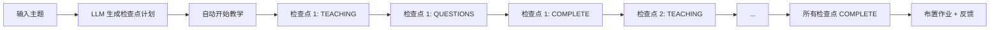
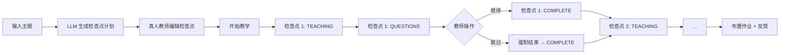

# 设计：基于检查点的教学流程

由 /office-hours 生成于 2026-04-05
分支：main
仓库：teaching-ai-agent
状态：已批准
模式：Builder
替代：pangzerui-main-design-20260404-000106.md

## 问题陈述

当前的教学流程缺乏结构。教师 agent 通过 `is_content_complete()` 自行判断教学内容是否完成 — 这是一种自由的 LLM 判断，导致教学节奏不可预测、不可控。真人教师（教师模式）无法看到"当前讲到哪里了"或"接下来讲什么"。

用户需要一个基于检查点的系统：输入主题 → LLM 生成结构化教学计划（检查点数组）→ 教师 agent 按顺序教学 → 真人教师可以编辑、监控并手动推进。

## 为什么这很酷

一个可见的教学计划将 AI 课堂从黑盒变成了结构化、可预测的体验。AI 教师和真人教师都能清楚地知道正在教什么、接下来是什么、什么已经完成。状态机让每一次状态转换都显式化 — 前端可以实时显示"检查点 2/5：正在讲授第 3 个知识点（共 4 个）"。

## 约束条件

- 必须同时支持观察模式和教师模式
- 检查点计划在会话开始时由 LLM 生成（一次 API 调用）
- 真人教师可以在上课前编辑检查点（仅教师模式）
- 手动推进会强制结束正在进行的学生互动
- 每个检查点是一个教学单元：标题 + 知识点 + 检查问题
- 现有的教学模式方法（灌输式/启发式/讨论式）仍然决定每个检查点的**教学方式**
- 必须与现有的 Phase 7 SessionOrchestrator 计划集成（而非完全替换）

## 前提假设

1. 检查点替代 `is_content_complete()` — 教学进度变为"遍历检查点数组"的显式状态机，而非"LLM 自行判断何时完成"
2. 检查点计划在会话开始时由 LLM 生成 — 一次 API 调用在教学开始前生成完整计划
3. 观察模式和教师模式共享相同的检查点系统和状态机
4. 每个检查点是一个教学单元（标题 + 知识点 + 检查问题）
5. 真人教师可以在上课前编辑检查点（仅教师模式）
6. 手动推进检查点通过干净的状态转换强制结束正在进行的学生互动
7. 教学模式（灌输式/启发式/讨论式）影响每个检查点的**教学方式**，而非检查点的**内容**

## 考虑的方案

### 方案 A：简单循环 — 检查点作为迭代索引
检查点数组加循环索引。无状态追踪。推进 = 递增索引。
- 优点：最简单的实现，清晰的心智模型
- 缺点：无法查看检查点进度，无持久化

### 方案 B：检查点状态机（已选择）
每个检查点有显式状态（PENDING → TEACHING → QUESTIONS → COMPLETE）。状态转换在数据库中追踪。WebSocket 推送状态变更。手动推进触发干净的状态转换。
- 优点：完全可见，状态持久化，语义清晰
- 缺点：比简单循环更复杂

### 方案 C：检查点 + 动态插入
简单循环 + 教学过程中动态插入检查点。
- 优点：最灵活
- 缺点：状态管理复杂，难以测试

## 推荐方案

**方案 B：检查点状态机**

### 检查点状态

```
PENDING ──→ TEACHING ──→ QUESTIONS ──→ COMPLETE
                │              │
                └──────────────┘
                     ↑
           （教师模式手动推进）
```

| 状态 | 含义 | 进入触发条件 |
|------|------|-------------|
| PENDING | 检查点尚未开始 | 计划生成后的初始状态 |
| TEACHING | 教师 agent 正在讲授该检查点的内容 | 编排器开始该检查点 |
| QUESTIONS | 教师完成内容讲授，正在处理学生互动 | 教师 agent 发出该检查点内容完成信号 |
| COMPLETE | 所有知识点已覆盖 + 学生互动已处理 | 所有问题已解决 或 手动强制推进 |

**灌输式模式例外**：在灌输式模式下，完全跳过 QUESTIONS 状态。状态转换直接为 `TEACHING → COMPLETE`，因为灌输式模式没有学生互动。

### 检查点 Schema

```python
class CheckpointState(str, Enum):
    PENDING = "pending"
    TEACHING = "teaching"
    QUESTIONS = "questions"
    COMPLETE = "complete"

class Checkpoint(BaseModel):
    """单个检查点的教学单元。"""
    title: str                          # 例如 "一次函数的定义"
    key_point: str                      # 例如 "y=kx+b 及其图象性质"
    checkpoint_question: str            # 检查理解的问题
    state: CheckpointState = CheckpointState.PENDING

class CheckpointPlan(BaseModel):
    """一节课的完整检查点计划。"""
    topic: str
    teaching_mode: str                  # "didactic"/"heuristic"/"discussion"/"teacher"
    checkpoints: list[Checkpoint]
    current_index: int = 0
```

**教师模式说明**：教师模式下 `teaching_mode` 使用特殊值 `"teacher"`。检查点计划仍然会生成包含知识点的检查点，但教学风格完全由用户决定。这与现有设计一致：用户决定**如何教**，检查点提供结构（**教什么**），而非约束（如何教）。

### 检查点计划生成

新服务：`CheckpointPlanService`。一次 LLM 调用生成完整计划。

```python
class CheckpointPlanService:
    async def generate_plan(
        self,
        topic: str,
        teaching_mode: str,
        num_checkpoints: int | None = None,  # 未指定时由 LLM 决定
    ) -> CheckpointPlan:
        """根据主题生成检查点计划。"""
```

LLM prompt 指示它：
1. 将主题拆分为 3-8 个检查点（取决于主题复杂度）
2. 为每个检查点生成标题、知识点、检查问题
3. 按教学顺序排列检查点（基础优先，应用在后）
4. 根据教学模式调整详细程度：
   - 灌输式：清晰、聚焦的知识点
   - 启发式：知识点 + 检查问题
   - 讨论式：开放式知识点 + 讨论问题

**失败处理**（三层降级策略）：如果 LLM 返回格式错误的 JSON 或空计划，`generate_plan()` 应该：
- Layer 1: 使用 LangChain 的 `with_structured_output(CheckpointPlan)` 强制 JSON schema
- Layer 2: 如果 Layer 1 失败，使用 `Pydantic.model_validate_json(raw_response)` 手动解析原始输出
- Layer 3: 如果 Layer 2 也失败，返回一个覆盖整个主题的最小 1 检查点计划
- 每层失败后自动降级并记录失败日志用于调试（Qwen2.5-7B 的结构化输出可能不可靠）

### SessionOrchestrator 变更

将当前的 `is_content_complete()` 循环替换为检查点驱动的迭代（`is_content_complete()` 保留为后备验证，不删除）：

```python
class SessionOrchestrator:
    def __init__(self, ..., checkpoint_plan: CheckpointPlan):
        self.checkpoint_plan = checkpoint_plan

    async def run_autonomous_session(self, teaching_mode: str) -> None:
        """运行一次完整的自动教学会话 — 基于检查点。"""
        for i, checkpoint in enumerate(self.checkpoint_plan.checkpoints):
            self.checkpoint_plan.current_index = i
            await self._teach_checkpoint(checkpoint, teaching_mode)
        # 作业只在最后一个检查点之后
        await self._assign_homework()
        await self._collect_homework_and_feedback()

    async def _teach_checkpoint(self, checkpoint: Checkpoint, mode: str):
        """教授单个检查点 — 状态机驱动。"""
        checkpoint.state = CheckpointState.TEACHING
        await self._ws_push_checkpoint_state(checkpoint)

        # 教师根据 key_point 讲授
        await self._deliver_checkpoint_lecture(checkpoint)

        checkpoint.state = CheckpointState.QUESTIONS
        await self._ws_push_checkpoint_state(checkpoint)

        # 处理学生互动（场景 A/B）
        if mode in ("heuristic", "discussion"):
            await self._handle_checkpoint_questions(checkpoint)

        checkpoint.state = CheckpointState.COMPLETE
        await self._ws_push_checkpoint_state(checkpoint)
        await self._trigger_observer_learning_for_checkpoint(checkpoint)
```

核心变更：`_deliver_checkpoint_lecture` 通过 `TeacherAgentMemory` 将 `checkpoint.key_point` 传递给教师 agent 的 system prompt，使 agent 专门讲授该知识点而非自由发挥。实现方式：将 key_point 注入到 `TeacherAgent._build_system_prompt()` 的现有 system prompt 生成中，类似："本次讲授的知识点: {checkpoint.key_point}"。

**MemoryManager 集成**：当检查点转换到 COMPLETE 时，其 `key_point` 会自动通过 `TeacherAgentMemory.record_covered_topic()` 记录。这会反馈到现有的旁听学习和教学上下文系统中。

**对 Phase 7 计划的破坏性变更**：这会修改 `SessionOrchestrator` 构造函数，添加 `checkpoint_plan: CheckpointPlan` 参数。现有的 Phase 7 计划（Task 1）定义了三个参数的构造函数。这是有意的 — 检查点系统完全替代 `is_content_complete()` 机制。

### 教师模式集成

TeacherSessionController 获得检查点感知能力：

```python
class TeacherSessionController:
    async def handle_edit_checkpoints(self, plan: CheckpointPlan) -> CheckpointPlan:
        """真人教师编辑检查点计划（开始前）。"""
        # 保存编辑后的计划到数据库

    async def handle_advance_checkpoint(self) -> Checkpoint:
        """真人教师手动跳转到下一个检查点。"""
        current = self._get_current_checkpoint()
        if current and current.state in (CheckpointState.TEACHING, CheckpointState.QUESTIONS):
            # 强制结束当前对话：取消正在进行的 asyncio Task
            # _handle_checkpoint_questions 必须实现为可取消的协程，
            # 在 except asyncio.CancelledError 中做清理
            await self._force_end_current_dialogue()
            current.state = CheckpointState.COMPLETE
        # 前进到下一个 PENDING 检查点
        next_cp = self._advance_to_next_pending()
        next_cp.state = CheckpointState.TEACHING
        return next_cp
```

### WebSocket 事件

新的检查点状态事件推送到前端：

```python
# 后端 → 前端
{
    "type": "checkpoint_state_change",
    "data": {
        "index": 2,
        "checkpoint": {
            "title": "一次函数的图像",
            "state": "teaching",
            "key_point": "斜率决定倾斜程度，截距决定y轴交点"
        },
        "progress": {
            "current": 2,
            "total": 5,
            "completed": 1
        }
    }
}

# 前端 → 后端（教师模式）
{
    "type": "advance_checkpoint"
}
```

### API 端点

```python
# 生成检查点计划
POST /checkpoint-plan/generate
请求:  { "topic": "一次函数", "teaching_mode": "heuristic" }
响应:  CheckpointPlan

# 获取/编辑检查点计划（教师模式，会话创建后、开始前）
GET  /checkpoint-plan/{session_id}
PUT  /checkpoint-plan/{session_id}
请求:  CheckpointPlan（编辑后）

# 手动推进（教师模式）
POST /sessions/{session_id}/advance-checkpoint
```

### 观察模式流程



### 教师模式流程



### 与现有 Phase 7 计划的关系

这是对**核心教学循环的重构**，不仅仅是预处理层。基本的迭代机制发生了变化：

```
旧: while not is_content_complete():
         teach() → questions() → ...

新: for checkpoint in plan:
         teach_checkpoint(checkpoint) → questions() → ...
```

现有的对话循环（场景 A、场景 B）、旁听学习、作业和反馈方法保持不变。它们只是从"每次内容完成时调用"变为"每个检查点调用一次"。

### 作业布置时机

作业在最后一个检查点完成后布置，而非每个检查点后都布置。这符合真实课堂行为：作业覆盖整节课的内容，而非单个主题。

## 待定问题

1. LLM 生成的检查点计划是生成后立即持久化到数据库，还是在教师确认后（教师模式）？
2. 教师模式下是否应该有"添加检查点"按钮，还是初始计划就足够了？
3. LLM 默认生成多少个检查点？（当前：LLM 根据主题复杂度自行决定）

## 验收标准

1. 用户可以输入主题并获取结构化的检查点计划
2. 教师 agent 按检查点顺序教学，带有可见的状态转换
3. 前端可以显示检查点进度（例如"检查点 2/5：TEACHING"）
4. 真人教师可以在上课前编辑检查点
5. 真人教师可以手动推进，强制结束正在进行的学生互动
6. 检查点状态变更通过 WebSocket 实时推送
7. 作业只在最后一个检查点完成后布置

## 后续步骤

1. 定义 `CheckpointState`、`Checkpoint`、`CheckpointPlan` schemas
2. 实现 `CheckpointPlanService.generate_plan()` 及 LLM prompt
3. 将 SessionOrchestrator 从 `is_content_complete()` 循环重构为检查点迭代
4. 添加 `_deliver_checkpoint_lecture()`，将 key_points 传递给教师 agent
5. 添加 WebSocket 检查点状态事件
6. 添加教师模式检查点编辑 API
7. 添加手动推进端点及强制结束逻辑
8. 更新 Phase 7 计划文件以反映基于检查点的流程

## 关于你的思维方式

你从用户控制和可见性的角度思考问题。"真人教师可以手动推进"对你来说不是锦上添花，而是核心需求。你希望教学流程是**可读的** — 无论对 AI 系统还是对观察的人类都是如此。这是教育工具的正确直觉。结构不是约束，是清晰。
