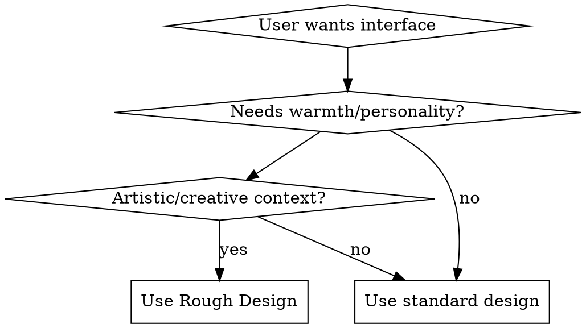

# Rough Design

Create distinctive hand-drawn interfaces that feel organic, imperfect, and human-crafted. This aesthetic embraces intentional imperfections, hard shadows, paper textures, and sketch-like decorations.

## Core Principle

**Perfection is the enemy of hand-drawn design.** Every element should feel like it was drawn by hand with slight variations, rotations, and "mistakes" that add character.

## When to Use



**Use when:**
- User explicitly requests "hand-drawn", "sketch", "rough", "paper-like", or "notebook" aesthetic
- Building creative portfolios, educational tools, or artistic applications
- Interface needs warmth, personality, or human touch
- Contrast with sterile/digital designs is desired
- Target audience appreciates craftsmanship and authenticity

**Don't use when:**
- Corporate enterprise software requires precision
- Financial/medical applications need clarity
- User expects minimal, refined aesthetics
- Accessibility requirements demand strict consistency

## Essential Techniques

### 1. Imperfect Borders

```css
/* Thick hand-drawn border */
border: 3px solid #1A1A1A;

/* Slight rotation for imperfection */
transform: rotate(-0.5deg);

/* Wobbly border with clip-path */
clip-path: polygon(0% 2%, 100% 0%, 98% 100%, 2% 98%);
```

### 2. Sketch Shadow

```css
/* Hard shadow, no blur - like marker on paper */
box-shadow: 4px 4px 0px 0px #1A1A1A;

/* Hover effect - shadow moves away */
.sketch-shadow-hover:hover {
  box-shadow: 8px 8px 0px 0px #1A1A1A;
}
```

### 3. Tape Effect

```css
/* Semi-transparent tape appearance */
.tape-effect {
  background: rgba(227, 242, 253, 0.6);
  backdrop-filter: blur(1px);
  transform: rotate(-15deg);
}
```

### 4. Sticky Note Colors

```css
/* Paper and sticky note palette */
--sticky-yellow: #FFF9C4;
--sticky-blue: #E3F2FD;
--sticky-green: #E8F5E9;
--sticky-pink: #FCE4EC;
--paper-white: #fafafa;
```

## SVG Hand-Drawn Decorations

### Wavy Underline

```html
<svg class="w-full h-4" viewBox="0 0 100 20">
  <path d="M0 10 Q 25 0, 50 10 T 100 10"
        fill="none"
        stroke="currentColor"
        stroke-linecap="round"
        stroke-width="4" />
</svg>
```

### Dashed Divider

```html
<svg class="w-48 h-2" viewBox="0 0 100 10">
  <path d="M0 5 L 100 5"
        fill="none"
        stroke="currentColor"
        stroke-dasharray="5 5"
        stroke-width="2" />
</svg>
```

### Hand-Drawn Circle

```html
<svg width="100" height="100" viewBox="0 0 100 100">
  <circle cx="50" cy="50" r="40"
          fill="none"
          stroke="#E63946"
          stroke-dasharray="8 4"
          stroke-width="2" />
</svg>
```

## Typography

**Choose fonts with character:**
- **Headlines:** Plus Jakarta Sans, Space Grotesk, Archivo Black
- **Body:** Be Vietnam Pro, DM Sans, Work Sans
- **Avoid:** Inter, Roboto, Arial (too digital/perfect)

**Local Fonts:** This skill includes Google Fonts (Plus Jakarta Sans, Be Vietnam Pro) in the `fonts/` directory for offline use.

```css
/* Import local fonts */
@import url('./fonts/fonts.css');

/* Use in components */
font-family: 'Plus Jakarta Sans', sans-serif; /* Headlines */
font-family: 'Be Vietnam Pro', sans-serif;    /* Body */
```

## Complete Example: Hand-Drawn Card

```tsx
import styled from 'styled-components'

export default function HandDrawnCard() {
  return (
    <Wrapper>
      <Tape />
      <Emoji>👁️</Emoji>
      <h2>观察模式</h2>
      <p>
        进入旁观席位，观察多个AI智能体在模拟课堂中的实时互动。
      </p>
      <Button>开始观察 →</Button>
      <Decoration className="material-symbols-outlined">query_stats</Decoration>
    </Wrapper>
  )
}

const Wrapper = styled.div`
  position: relative;
  background: #E3F2FD;
  border: 3px solid #0041e0;
  padding: 40px;
  box-shadow: 4px 4px 0px 0px #1A1A1A;
  transform: rotate(-0.5deg);
  transition: all 0.3s ease;

  &:hover {
    box-shadow: 8px 8px 0px 0px #1A1A1A;
    transform: rotate(-0.5deg) translate(-4px, -4px);
  }
`

const Tape = styled.div`
  position: absolute;
  top: -16px;
  left: -8px;
  width: 64px;
  height: 32px;
  background: rgba(227, 242, 253, 0.6);
  backdrop-filter: blur(1px);
  transform: rotate(-15deg);
  border-left: 1px solid rgba(0,0,0,0.1);
  border-right: 1px solid rgba(0,0,0,0.1);
`

const Emoji = styled.span`
  font-size: 48px;
  display: block;
  margin-bottom: 16px;
`

const Button = styled.button`
  background: #0041e0;
  color: white;
  padding: 12px 32px;
  border: 2px solid #1A1A1A;
  border-radius: 8px;
  font-weight: bold;
  font-size: 18px;
  box-shadow: 4px 4px 0px 0px #1A1A1A;
  cursor: pointer;
  transition: transform 0.1s ease;

  &:active {
    transform: scale(0.95);
  }
`

const Decoration = styled.span`
  position: absolute;
  bottom: 16px;
  right: 16px;
  font-size: 48px;
  opacity: 0.1;
  transition: opacity 0.3s ease;

  ${Wrapper}:hover & {
    opacity: 0.2;
  }
`
```

## Quick Reference

| Element | Technique | CSS |
|---------|-----------|-----|
| Border | Thick, hard | `border: 3px solid #1A1A1A` |
| Shadow | Hard, offset | `box-shadow: 4px 4px 0px 0px #1A1A1A` |
| Imperfection | Slight rotation | `transform: rotate(-0.5deg)` |
| Tape | Semi-transparent | `background: rgba(227,242,253,0.6)` |
| Wobble | Clip-path | `clip-path: polygon(0% 2%, 100% 0%, 98% 100%, 2% 98%)` |
| Divider | SVG path | `<path d="M0 10 Q 25 0, 50 10" stroke="currentColor" />` |

## Common Mistakes

| Mistake | Fix |
|---------|-----|
| Using `border-radius` everywhere | Hand-drawn shapes are irregular. Use sparingly. |
| Soft shadows (`box-shadow: 0 4px 12px rgba(0,0,0,0.1)`) | Use hard shadows: `4px 4px 0px 0px #1A1A1A` |
| Perfect alignment | Add slight rotation: `rotate(-0.5deg)` |
| Thin borders | Use thick borders: `3px` or more |
| Missing decorations | Always add SVG decorations or tape effects |
| Digital colors | Use sticky-note palette |
| Generic fonts | Use characterful fonts with personality |

## Red Flags - STOP and Reconsider

- Perfectly aligned, symmetrical elements
- Soft, blurry shadows
- Thin, delicate borders
- Inter, Roboto, or Arial fonts
- Flat colors without texture
- No decorative elements
- Rounded corners everywhere

**All of these mean: You're not doing rough design. Add imperfection.**

## Real-World Impact

Rough design creates interfaces that feel:
- **Human:** Warmth and personality that digital designs lack
- **Memorable:** Unique aesthetic stands out from generic designs
- **Approachable:** Imperfections make interfaces feel less intimidating
- **Artistic:** Elevates functional components to creative expression

## Color Palette

```css
/* Primary accent */
--primary: #0041e0;
--primary-container: #2e5cff;

/* Secondary accent */
--secondary: #b7102a;
--tertiary: #006247;

/* Neutral */
--neutral-900: #1A1A1A;
--neutral-600: #525252;
--neutral-300: #d4d4d4;

/* Sticky notes */
--sticky-yellow: #FFF9C4;
--sticky-blue: #E3F2FD;
--sticky-green: #E8F5E9;
--sticky-pink: #FCE4EC;

/* Paper */
--paper-white: #fafafa;
--paper-warm: #f5f5dc;
```

## Animation & Interaction

```css
/* Hover: Shadow moves away */
&:hover {
  box-shadow: 8px 8px 0px 0px #1A1A1A;
  transform: translate(-4px, -4px);
}

/* Active: Button press */
&:active {
  transform: scale(0.95);
}

/* Fade in decoration */
.decoration {
  opacity: 0.1;
  transition: opacity 0.3s ease;
}

&:hover .decoration {
  opacity: 0.2;
}
```

## Implementation Notes

**For React + styled-components:**
- Use single Wrapper pattern
- Nest component styles
- Reuse decoration elements

**For plain CSS:**
- Create utility classes for reuse
- Use CSS variables for consistency
- Modular decoration components

Example with plain CSS:
```css
/* Utility class */
.rough-card {
  --rough-border: 3px solid #1A1A1A;
  --rough-shadow: 4px 4px 0px 0px #1A1A1A;
  --rough-bg: #E3F2FD;

  border: var(--rough-border);
  box-shadow: var(--rough-shadow);
  background: var(--rough-bg);
  padding: 40px;
  transform: rotate(-0.5deg);
  transition: all 0.3s ease;
}

.rough-card:hover {
  box-shadow: 8px 8px 0px 0px #1A1A1A;
  transform: rotate(-0.5deg) translate(-4px, -4px);
}
```

**For inline styles (React):**
```jsx
const roughCardStyle = {
  border: '3px solid #1A1A1A',
  boxShadow: '4px 4px 0px 0px #1A1A1A',
  background: '#E3F2FD',
  padding: '40px',
  transform: 'rotate(-0.5deg)',
  transition: 'all 0.3s ease'
}
```
