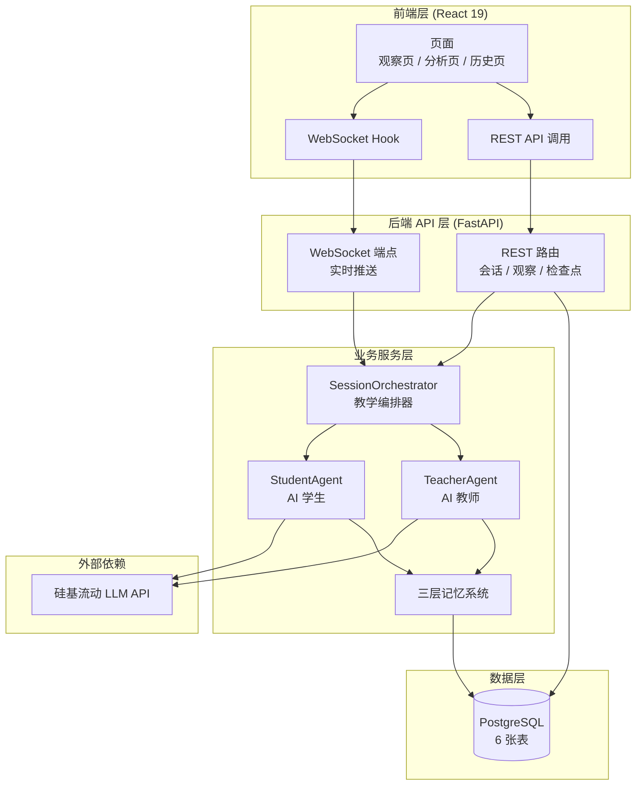
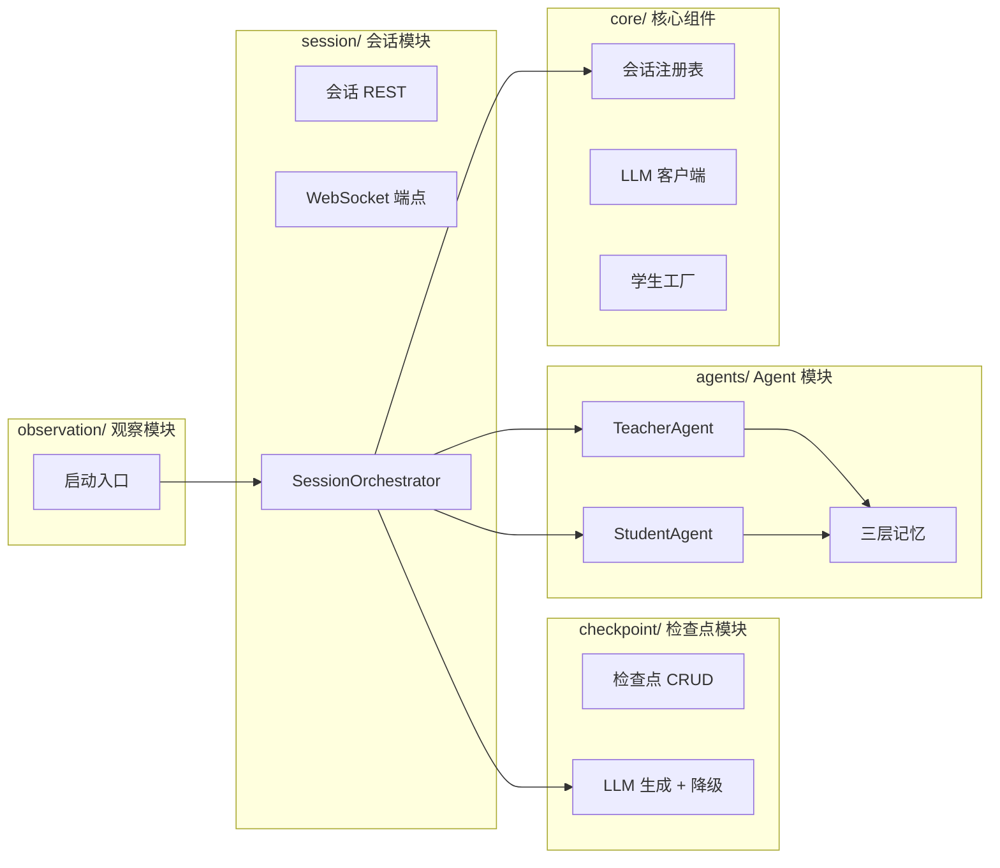
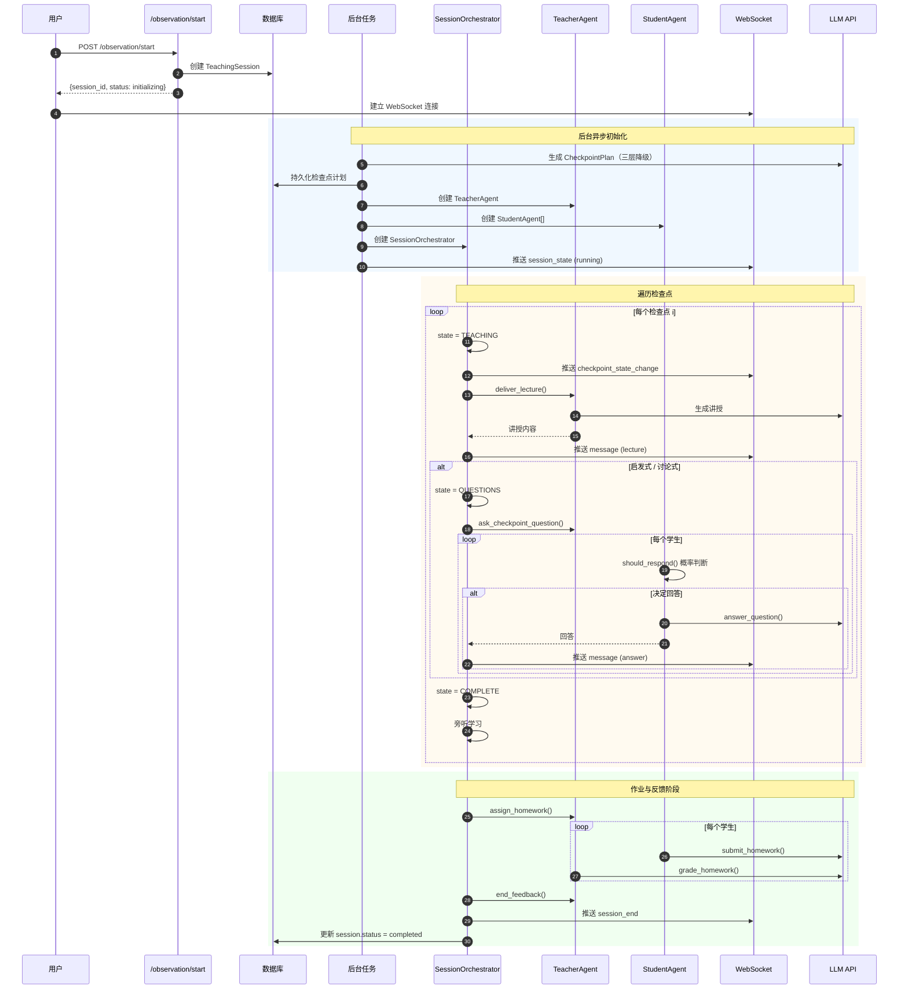
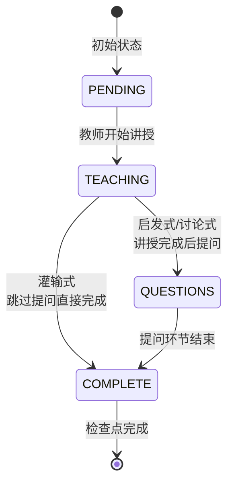
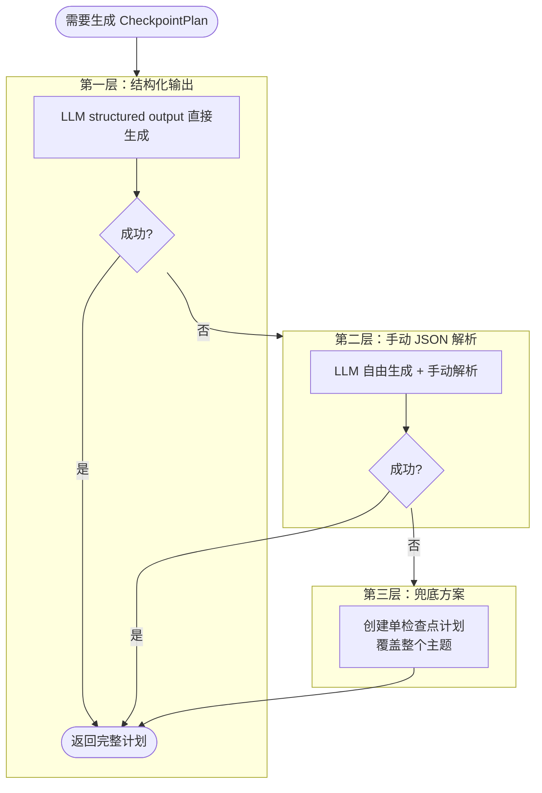
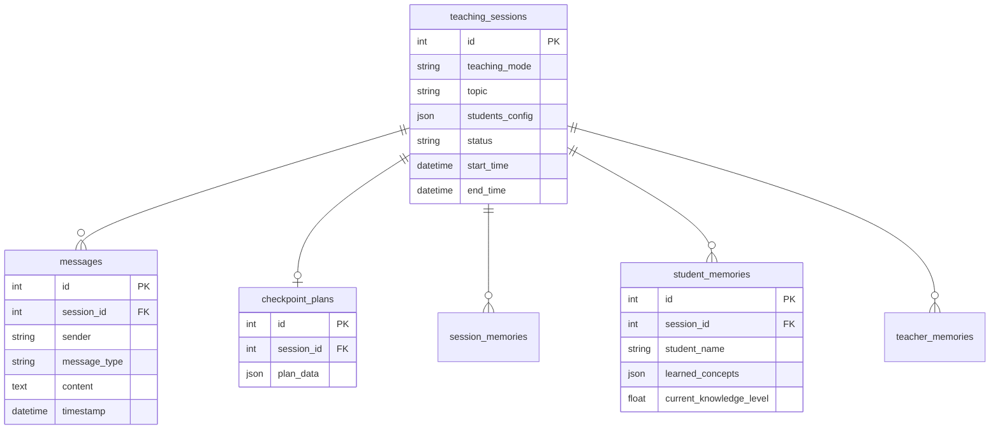

# 教学智能体系统架构文档

> 本文档介绍教学智能体（Teaching AI Agent）的总体架构、核心流程与输入输出数据。

---

## 目录

- [第一章 系统概述](#第一章-系统概述)
- [第二章 系统架构](#第二章-系统架构)
- [第三章 核心流程](#第三章-核心流程)
- [第四章 输入输出数据](#第四章-输入输出数据)

---

## 第一章 系统概述

### 1.1 项目定位

教学智能体系统是一个多智能体（Multi-Agent）教学模拟平台。系统通过大语言模型（LLM）驱动虚拟教师与虚拟学生，自动完成一节课的完整教学流程，用于对比研究三种典型教学模式的教学效果：

| 教学模式 | 英文 | 特征 |
|---------|------|------|
| 灌输式 | didactic | 教师单向讲授，不进行提问互动 |
| 启发式 | heuristic | 讲授过程中穿插检查点提问 |
| 讨论式 | discussion | 频繁的开放式提问与引导讨论 |

系统采用 **观察模式（Observation Mode）**：用户作为旁观者，观看 AI 教师 agent 与多个 AI 学生 agent 自动完成一节课，用于教学研究与三种教学模式的效果对比。系统通过检查点（Checkpoint）驱动教学流程，每个检查点包含讲授、提问（启发/讨论式）、完成三个阶段。

### 1.2 技术栈

| 层次 | 技术选型 |
|------|---------|
| 后端框架 | FastAPI（异步 ASGI）+ Uvicorn |
| Agent 框架 | LangChain |
| 大模型服务 | 硅基流动 SiliconFlow API（Qwen3.5-27B） |
| 数据库 | PostgreSQL + SQLAlchemy 2.0（异步） |
| 实时通信 | WebSocket |
| 前端框架 | React 19 + TypeScript + Vite |
| 前端样式 | styled-components（Rough 手绘风格） |
| 前端图表 | ECharts |

### 1.3 系统总体架构

系统分为四层：前端层负责展示与交互，后端 API 层提供 REST 与 WebSocket 双通道通信，业务服务层包含编排器与 Agent，数据层负责持久化。外部依赖硅基流动 LLM API 提供大模型推理能力。

---

## 第二章 系统架构

### 2.1 后端模块划分

| 模块 | 职责 |
|------|------|
| session | 会话生命周期管理、WebSocket 双向通信、教学编排器 |
| checkpoint | 检查点计划的 LLM 生成、持久化、状态机推进 |
| observation | 观察模式启动入口 |
| agents | TeacherAgent 与 StudentAgent 的实现 |
| core | 跨模块基础设施（注册表、LLM 客户端、学生工厂） |

### 2.2 核心控制器 SessionOrchestrator

`SessionOrchestrator`（`backend/models/session/services/observation_service.py`）是观察模式的核心控制器，负责自动编排整节课的教学流程，无需用户介入。

| 维度 | 说明 |
|------|------|
| 驱动方式 | 自动循环遍历检查点 |
| TeacherAgent | 有，AI 教师自动讲授提问 |
| StudentAgent | 有，AI 学生按态度概率应答 |
| 入口 | `POST /observation/start` |
| 核心方法 | `run_autonomous_session()` |
| 适用场景 | 教学研究、三种教学模式效果对比 |

### 2.3 三层记忆系统

Agent 记忆按业务域拆分为三层，由 `MemoryManager` 统一编排。

| 记忆类型 | 职责 | 关键字段 |
|---------|------|---------|
| SessionMemory | 会话级共享记忆 | topic、message_history、teaching_summary |
| TeacherAgentMemory | 教师专用记忆 | covered_topics、student_participation |
| StudentAgentMemory | 学生专用记忆 | learned_concepts、current_knowledge_level |

`MemoryManager` 接收每条消息后按 `MessageType` 分发到对应记忆模块，检查点边界时生成阶段性摘要。历史消息超限时自动截断以适配 LLM 上下文窗口。

### 2.4 前端架构

前端通过 **REST + WebSocket 双通道** 与后端通信：
- **REST**：一次性数据查询（会话列表、历史消息、分析报告）
- **WebSocket**：实时教学过程推送（消息流、检查点进度、会话状态）

观察页同时使用 WebSocket Hook 与 REST Hook，先通过 REST 拉取历史消息，再通过 WebSocket 接收实时消息。前端组件库采用 Rough 手绘风格（粗边框 + 硬阴影 + 微旋转）。

---

## 第三章 核心流程

### 3.1 观察模式完整流程

观察模式从用户提交配置开始，自动完成整节课的教学。

**流程要点**：
1. 用户提交配置后立即返回 `session_id`，教学在后台异步进行
2. LLM 自动生成检查点计划（三层降级保证鲁棒性）
3. 每个检查点经历 TEACHING → QUESTIONS（启发/讨论）→ COMPLETE
4. 灌输式跳过 QUESTIONS 阶段
5. 所有教学消息与状态变更通过 WebSocket 实时推送
6. 未参与对话的学生在检查点结束时触发旁听学习

### 3.2 检查点状态机

每个检查点有四种状态，构成线性状态机：

灌输式直接从 TEACHING 跳到 COMPLETE，启发式与讨论式经历完整的三个阶段。

### 3.3 三种教学模式差异

| 维度 | 灌输式 (didactic) | 启发式 (heuristic) | 讨论式 (discussion) |
|------|------------------|-------------------|---------------------|
| 检查点流程 | TEACHING → COMPLETE | TEACHING → QUESTIONS → COMPLETE | TEACHING → QUESTIONS → COMPLETE |
| 提问频率 | 0（无提问） | 每检查点 1 次 | 频繁开放式提问 |
| LLM 温度 | 0.3（保守） | 0.5（平衡） | 0.7（发散） |
| 学生参与度预期 | 低 | 中 | 高 |

温度配置位于 `backend/configs/llm.yml`，模式提示词位于 `backend/agents/teacher_agent.py`。

### 3.4 检查点计划生成与三层降级

观察模式启动时，系统通过 LLM 自动生成检查点计划。为保证鲁棒性采用三层降级：

第一层尝试 LLM 结构化输出，失败后降级到手动 JSON 解析，再失败则使用单检查点兜底方案，确保教学流程总能启动。

---

## 第四章 输入输出数据

### 4.1 输入数据

**观察模式启动配置**（`ObservationConfig`）：

| 字段 | 类型 | 说明 |
|------|------|------|
| topic | string | 教学主题（如"Python 变量与数据类型"） |
| teaching_mode | string | 教学模式：didactic / heuristic / discussion |
| students | StudentProfile[] | 学生列表（1-50 个） |

**学生画像**（`StudentProfile`）：

| 字段 | 说明 |
|------|------|
| name | 姓名 |
| level | 水平：excellent / average / basic |
| attitude | 态度：active / neutral / passive |
| learning_ability | 学习能力（1-10） |

学生态度决定响应概率：active=0.8、neutral=0.5、passive=0.2。

**学生创建方式**：系统支持手动配置、按分布随机生成、JSON 导入三种方式。随机生成时使用内置中文姓名池（约 70 姓氏 × 80 名字），保证班级内姓名不重复。

### 4.2 输出数据（WebSocket 事件）

教学过程通过 WebSocket 实时推送以下事件：

| 事件 type | 说明 |
|-----------|------|
| `connected` | 连接建立确认 |
| `message` | 教学消息（讲授/提问/回答等） |
| `checkpoint_state_change` | 检查点状态变更（含进度） |
| `session_state` | 会话状态变更（initializing/running/ended） |
| `session_end` | 会话结束 |

**消息类型**（MessageType）共 12 种：

| 类型 | 说明 |
|------|------|
| lecture | 教师讲授 |
| checkpoint_question | 检查点提问 |
| answer_to_checkpoint | 学生回答检查点 |
| question_to_teacher | 学生主动提问 |
| teacher_reply / reply_to_student | 对话循环回复 |
| assign_homework | 布置作业 |
| homework_submission | 作业提交 |
| homework_feedback | 作业评分反馈 |
| end_feedback | 结束反馈 |

### 4.3 数据库表结构

数据库采用 PostgreSQL，共 6 张表：

| 表名 | 说明 |
|------|------|
| `teaching_sessions` | 会话主表（主题、模式、状态、时间） |
| `messages` | 全部教学消息（12 种类型） |
| `checkpoint_plans` | 检查点计划（JSON 存储完整计划） |
| `session_memories` | 会话级记忆与摘要 |
| `student_memories` | 学生级记忆（每个学生一条，记录学习轨迹） |
| `teacher_memories` | 教师级记忆（覆盖主题、参与度） |

### 4.4 教学产出数据

一节课结束后沉淀的数据：

- **消息历史**：所有教学消息按时间持久化，可回放整节课
- **检查点最终状态**：每个检查点 state=complete，完整计划保存到数据库
- **学生学习轨迹**：`learned_concepts`（已掌握）、`current_knowledge_level`（知识水平演变）、`confused_points`（疑点）
- **教师教学记录**：`covered_topics`（已覆盖主题）、`student_participation`（参与度统计）
- **会话摘要**：每个检查点边界自动生成阶段性摘要

### 4.5 LLM 配置

`backend/configs/llm.yml` 关键配置：

| 配置项 | 值 |
|--------|-----|
| 模型服务 | 硅基流动 SiliconFlow API |
| 学生模型 | Qwen/Qwen3.5-27B |
| 教师模型 | Qwen/Qwen3.5-27B |
| 默认温度 | 0.7 |
| 灌输式温度 | 0.3 |
| 启发式温度 | 0.5 |
| 讨论式温度 | 0.7 |

模型上下文自适应：27B 模型保留最近 50 条非系统消息，最大 50000 tokens 输入。

---

## 附录：关键源码索引

| 模块 | 文件路径 |
|------|---------|
| 应用入口 | `backend/main.py` |
| 观察模式编排器 | `backend/models/session/services/observation_service.py` |
| WebSocket 端点 | `backend/models/session/router_websocket.py` |
| MessageType 枚举 | `backend/models/session/schemas.py` |
| Checkpoint 状态机 | `backend/models/checkpoint/schemas.py` |
| 三层降级 | `backend/models/checkpoint/services/plan_service.py` |
| TeacherAgent | `backend/agents/teacher_agent.py` |
| StudentAgent | `backend/agents/student_agent.py` |
| 三层记忆 | `backend/agents/memories/` |
| 学生工厂 | `backend/core/student_factory.py` |
| LLM 客户端 | `backend/core/llm_client.py` |
| LLM 配置 | `backend/configs/llm.yml` |
| 前端路由 | `frontend/src/App.tsx` |
| 前端 WebSocket | `frontend/src/hooks/useWebSocketBase.ts` |
